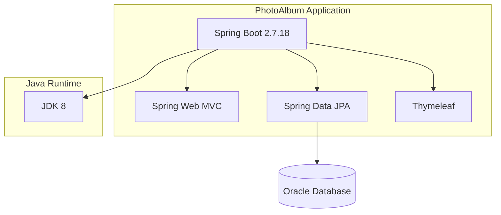
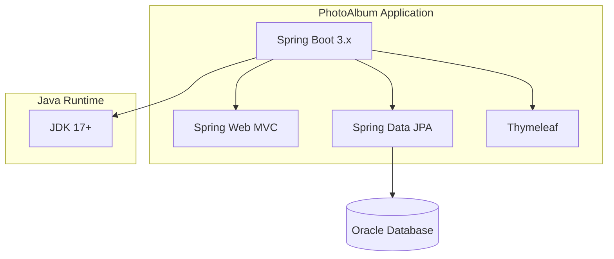

# Modernization Plan

**Branch**: `copilot/run-appmod-kit-plan` | **Date**: 2025-11-28

---

## Modernization Goal

Modernize the PhotoAlbum Java application by upgrading Spring Boot from 2.7.18 to 3.x, which includes upgrading JDK from 8 to 17, Spring Framework to 6.x, and migrating from JavaEE (javax.*) to Jakarta EE (jakarta.*).

## Scope

1. Java Upgrade
   - Spring Boot (2.7.18 → 3.x) - includes JDK 8→17, Spring Framework 6.x, and Jakarta EE migration

## Application Information

### Current Architecture

**Current Stack:**
- Java Version: 1.8 (JDK 8)
- Spring Boot: 2.7.18
- Spring Framework: 5.x (via Spring Boot 2.7.x)
- Database: Oracle (ojdbc8 driver)
- Template Engine: Thymeleaf
- Build Tool: Maven

## Target Architecture

**Target Stack:**
- Java Version: 17+ (JDK 17)
- Spring Boot: 3.x
- Spring Framework: 6.x (via Spring Boot 3.x)
- Jakarta EE (jakarta.* namespace)
- Database: Oracle (ojdbc11 driver)
- Template Engine: Thymeleaf
- Build Tool: Maven

## Task Breakdown

1) Task name: Upgrade Spring Boot to 3.x
   - Task Type: Java Upgrade
   - Description: Upgrade Spring Boot from 2.7.18 to 3.x. This includes upgrading JDK from 8 to 17, Spring Framework from 5.x to 6.x, and migrating from JavaEE (javax.*) to Jakarta EE (jakarta.*).
   - Solution Id: spring-boot-upgrade
