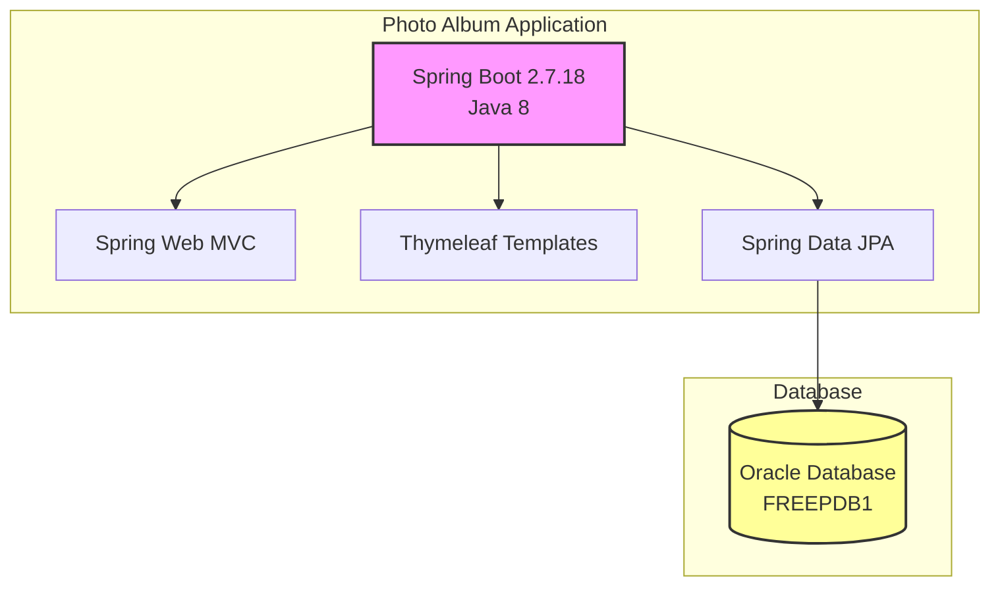
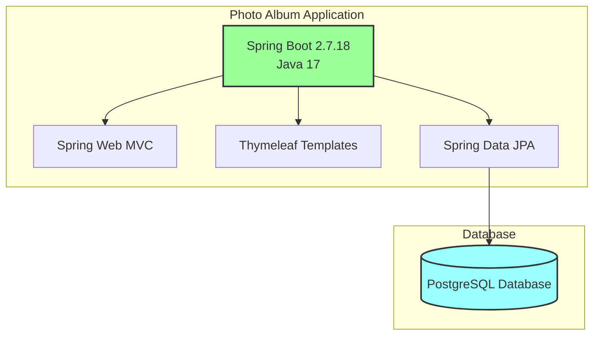

# Modernization Plan

**Branch**: `001-upgrade-java-oracle-to-postgresql` | **Date**: 2025-11-28

---

## Modernization Goal

Upgrade the Java version and migrate the database from Oracle to PostgreSQL. This modernization will update the application to use the latest stable Java version and replace the Oracle database dependency with PostgreSQL for improved compatibility, cost efficiency, and cloud readiness.

## Scope

According to the project analysis and user request, the modernization scope includes:

1. Java Upgrade
   - JDK (8 → 17) [based on user request to upgrade Java version]
   
2. Migration To Azure
   - Migrate database from Oracle to PostgreSQL [based on user request]

## Application Information

### Current Architecture

**Application Framework Information:**
- Spring Boot Version: 2.7.18
- Java Version: 1.8 (Java 8)
- Build Tool: Maven
- Template Engine: Thymeleaf

**Resource/Services Dependencies:**
- Oracle Database (FREEPDB1)
- Oracle JDBC Driver (ojdbc8)

**Connector Framework:**
- Spring Data JPA with Hibernate
- Oracle Dialect (org.hibernate.dialect.OracleDialect)

## Target Architecture

**Application Framework Information:**
- Spring Boot Version: 2.7.18 (unchanged for this iteration)
- Java Version: 17
- Build Tool: Maven

**Target Resource/Services Dependencies:**
- PostgreSQL Database
- PostgreSQL JDBC Driver

**Connector Framework:**
- Spring Data JPA with Hibernate
- PostgreSQL Dialect (org.hibernate.dialect.PostgreSQLDialect)

## Task Breakdown

1) Task name: Upgrade JDK to 17
   - Task Type: Java Upgrade
   - Description: Upgrade the application from Java 8 to Java 17 for improved security, performance, and access to modern language features. This includes updating the Maven compiler configuration and ensuring compatibility with JDK 17.
   - Solution Id: java-version-upgrade

2) Task name: Migrate from Oracle DB to PostgreSQL
   - Task Type: Migration To Azure
   - Description: Migrate the database from Oracle to PostgreSQL. This includes replacing the Oracle JDBC driver with PostgreSQL driver, updating the datasource configuration, changing the Hibernate dialect from OracleDialect to PostgreSQLDialect, and updating any Oracle-specific SQL or configurations.
   - Solution Id: oracle-to-postgresql
