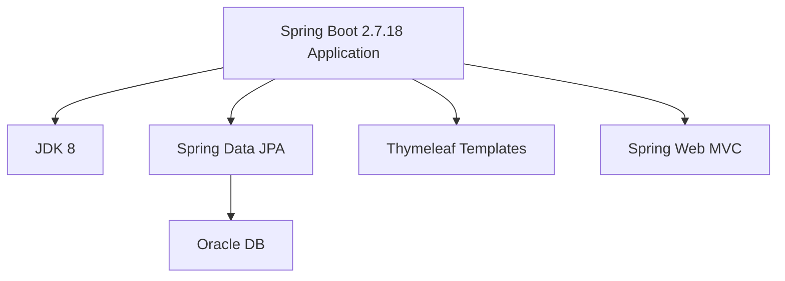
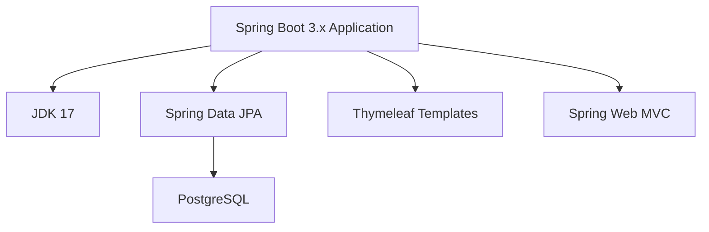

# Modernization Plan

**Branch**: `001-upgrade-jdk-migrate-oracle-to-postgres` | **Date**: 2025-11-28

---

## Modernization Goal

Upgrade the Java version and migrate the database from Oracle to PostgreSQL. This includes upgrading the application framework to the latest supported versions and replacing Oracle DB with PostgreSQL for improved compatibility with Azure services.

## Scope

According to the project information and user request, the scope for this modernization includes:

1. Java Upgrade
   - JDK (8 → 17) [included in Spring Boot 3.x upgrade]
   - Spring Boot (2.7.18 → 3.x) [required for latest framework features]
2. Migration To Azure
   - Migrate database from Oracle to PostgreSQL [based on user request]

## Application Information

### Current Architecture

**Current Technology Stack:**
- **Application Framework**: Spring Boot 2.7.18
- **Java Version**: JDK 8
- **Database**: Oracle DB with ojdbc8 driver
- **ORM**: Spring Data JPA with Hibernate
- **Database Platform**: OracleDialect
- **Web Framework**: Spring Web MVC with Thymeleaf

## Target Architecture

**Target Technology Stack:**
- **Application Framework**: Spring Boot 3.x (latest stable)
- **Java Version**: JDK 17
- **Database**: PostgreSQL with postgresql driver
- **ORM**: Spring Data JPA with Hibernate
- **Database Platform**: PostgreSQLDialect
- **Web Framework**: Spring Web MVC with Thymeleaf

## Task Breakdown

1) Task name: Upgrade Spring Boot to 3.x  
   - Task Type: Java Upgrade  
   - Description: Upgrade from Spring Boot 2.7.18 to Spring Boot 3.x. This task includes: upgrading JDK from 8 to 17, Spring Framework to 6.x, and migrating from JavaEE (javax.*) to Jakarta EE (jakarta.*).  
   - Solution Id: spring-boot-upgrade  

2) Task name: Migrate from Oracle DB to PostgreSQL  
   - Task Type: Migration To Azure  
   - Description: Migrate the database from Oracle DB to PostgreSQL. This includes replacing Oracle JDBC driver with PostgreSQL driver, updating database connection configuration, and changing the Hibernate dialect from OracleDialect to PostgreSQLDialect.  
   - Solution Id: oracle-to-postgresql
