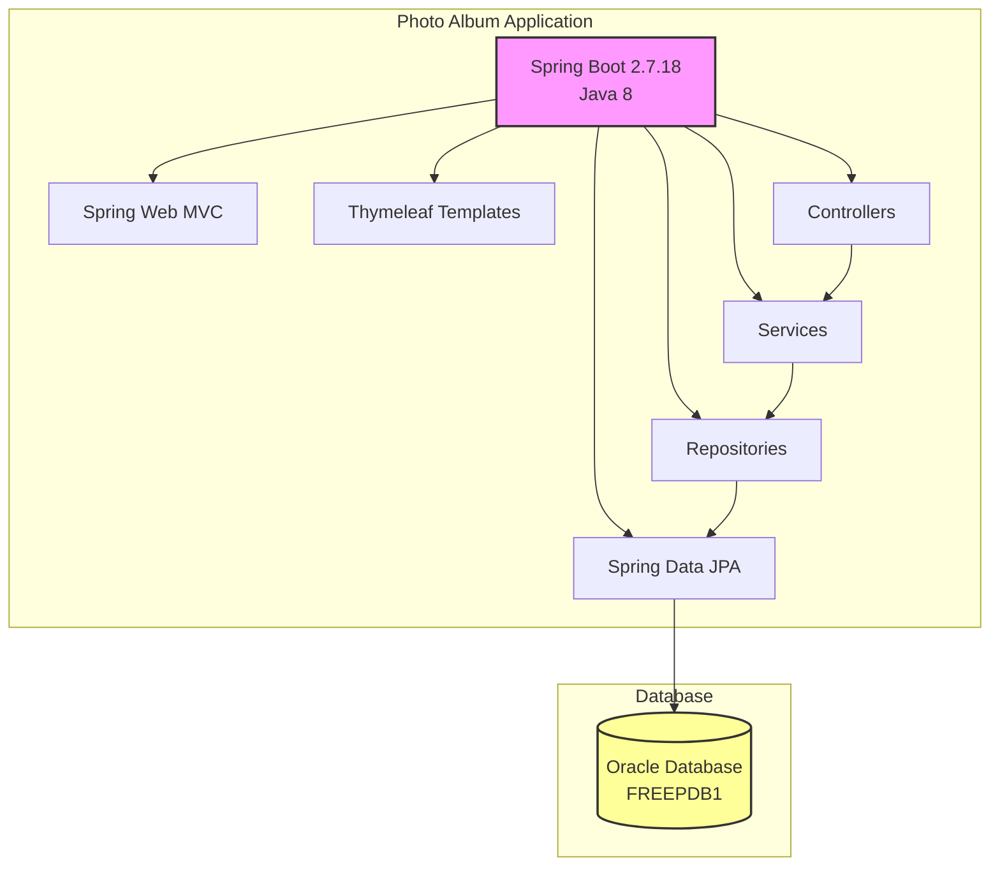
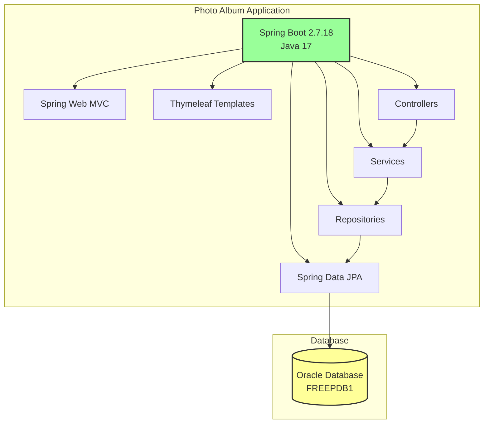

# Modernization Plan

**Branch**: `002-upgrade-java-version` | **Date**: 2025-12-08

---

## Modernization Goal

Upgrade the Java version from Java 8 to Java 17 to improve security, performance, and access to modern language features. This upgrade will ensure the application benefits from the latest Java enhancements while maintaining compatibility with the existing Spring Boot 2.7.18 framework.

## Scope

This section describes the scope that the modernization plan will cover.

According to the project information and user's request, the scope for modernization focuses on Java upgrade:

1. Java Upgrade
   - JDK (8 → 17) [based on user request to upgrade Java version]

## Application Information

### Current Architecture

**Application Framework Information:**
- Spring Boot Version: 2.7.18
- Java Version: 1.8 (Java 8)
- Build Tool: Maven
- Template Engine: Thymeleaf
- Packaging: JAR

**Resource/Services Dependencies:**
- Oracle Database (FREEPDB1)
- Oracle JDBC Driver (ojdbc8)

**Connector Framework:**
- Spring Data JPA with Hibernate
- Oracle Dialect (org.hibernate.dialect.OracleDialect)

**Key Dependencies:**
- Spring Boot Starter Web
- Spring Boot Starter Thymeleaf
- Spring Boot Starter Data JPA
- Spring Boot Starter Validation
- Commons IO 2.11.0
- H2 Database (test scope)

## Target Architecture

**Application Framework Information:**
- Spring Boot Version: 2.7.18 (unchanged for this iteration)
- Java Version: 17 (upgraded from 8)
- Build Tool: Maven
- Template Engine: Thymeleaf
- Packaging: JAR

**Target Resource/Services Dependencies:**
- Oracle Database (FREEPDB1) - unchanged
- Oracle JDBC Driver (ojdbc8) - unchanged

**Connector Framework:**
- Spring Data JPA with Hibernate
- Oracle Dialect (org.hibernate.dialect.OracleDialect)

**Changes:**
- JDK upgraded from 8 to 17
- Maven compiler source and target updated to 17
- Code compatibility verified for Java 17 features and deprecations
- All deprecated APIs from Java 9-17 will be reviewed and updated as needed

## Task Breakdown

1) Task name: Upgrade JDK to 17
   - Task Type: Java Upgrade
   - Description: Upgrade the application from Java 8 to Java 17 for improved security, performance, and access to modern language features. This includes updating the Maven compiler configuration (java.version, maven.compiler.source, maven.compiler.target) to 17, ensuring compatibility with JDK 17, handling any deprecated or removed APIs, and verifying that all dependencies work correctly with Java 17. The upgrade will maintain compatibility with Spring Boot 2.7.18.
   - Solution Id: java-version-upgrade
