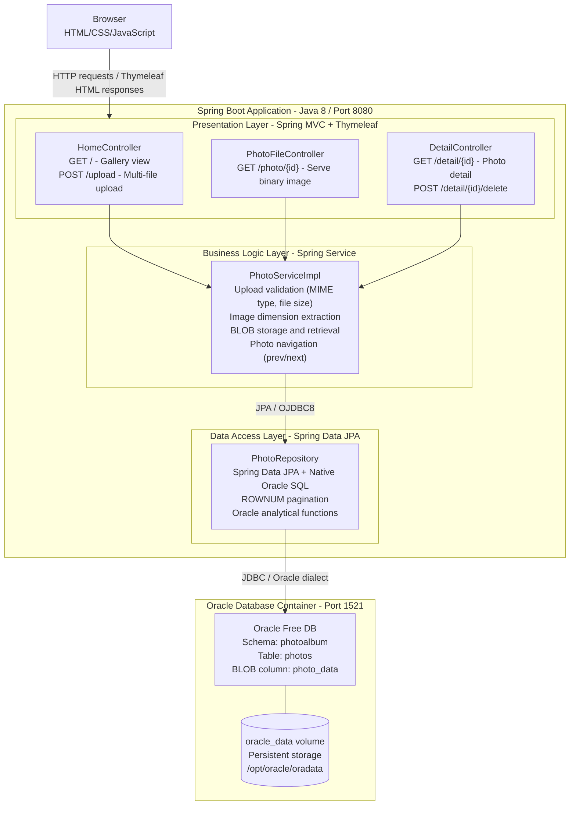

# Architecture Diagram

This diagram illustrates the current architecture of the PhotoAlbum Java application, a Spring Boot web application that stores and serves photo images using an Oracle database backend.

## Application Architecture

