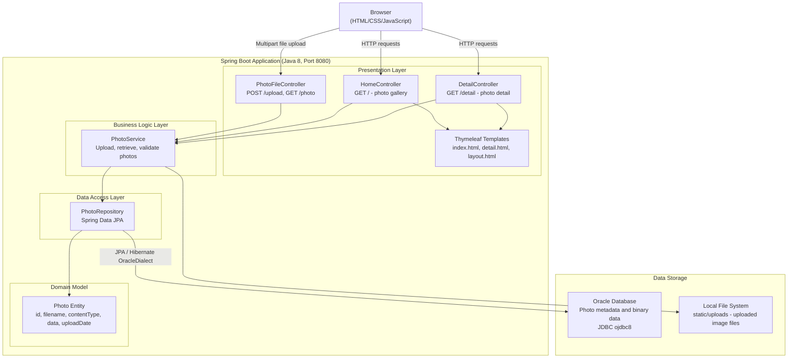

# Architecture Diagram

This diagram represents the current architecture of the Photo Album application, a Spring Boot web application using Oracle Database for persistence and local file storage for photo uploads.

## Application Architecture

