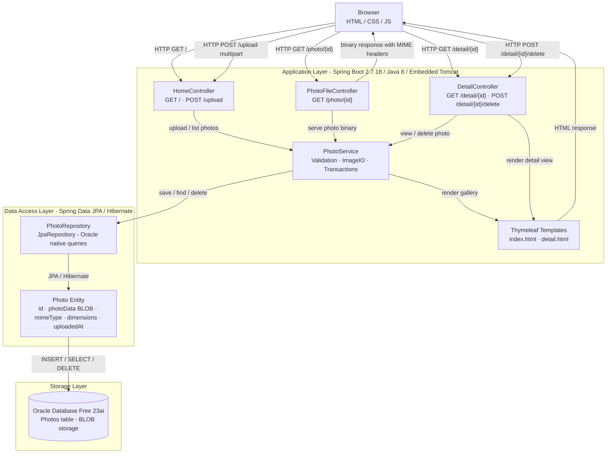

# Architecture Diagram

This diagram represents the high-level architecture of the Photo Album application, a Spring Boot web application that stores and serves photos using Oracle Database BLOB storage.

## Application Architecture

