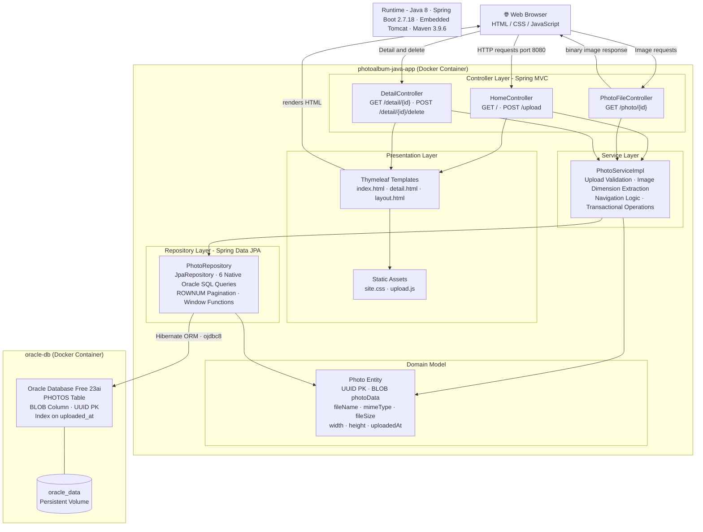

# Architecture Diagram

This diagram shows the high-level architecture of the Photo Album application, a Spring Boot 2.7 web application that stores photos as BLOBs in an Oracle database.

## Application Architecture

