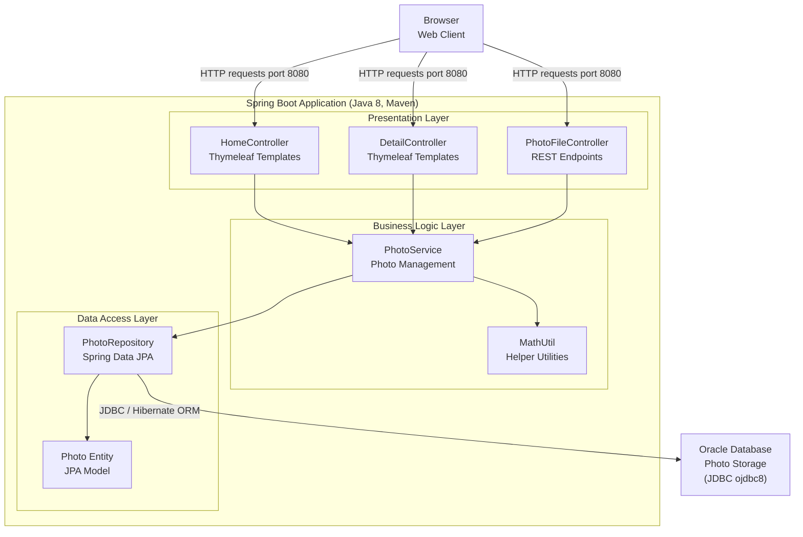

# Architecture Diagram

A Spring Boot photo album application that stores and serves images through a web UI, backed by an Oracle database.

## Application Architecture

```mermaid
flowchart TD
    Browser["Browser\nWeb Client"]

    subgraph App["Spring Boot Application (Java 8, Maven)"]
        subgraph Presentation["Presentation Layer"]
            HC["HomeController\nThymeleaf Templates"]
            DC["DetailController\nThymeleaf Templates"]
            PFC["PhotoFileController\nREST Endpoints"]
        end

        subgraph Business["Business Logic Layer"]
            PS["PhotoService\nPhoto Management"]
            MU["MathUtil\nHelper Utilities"]
        end

        subgraph Data["Data Access Layer"]
            PR["PhotoRepository\nSpring Data JPA"]
            Photo["Photo Entity\nJPA Model"]
        end
    end

    DB["Oracle Database\nPhoto Storage\n(JDBC ojdbc8)"]

    Browser -->|"HTTP requests port 8080"| HC
    Browser -->|"HTTP requests port 8080"| DC
    Browser -->|"HTTP requests port 8080"| PFC
    HC --> PS
    DC --> PS
    PFC --> PS
    PS --> MU
    PS --> PR
    PR --> Photo
    PR -->|"JDBC / Hibernate ORM"| DB
```
