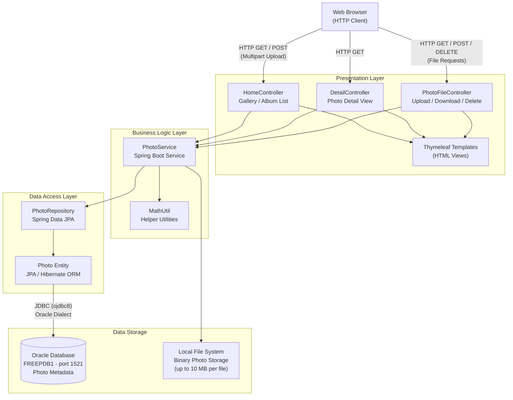

# Architecture Diagram

This diagram illustrates the high-level architecture of the Photo Album application, a Spring Boot web application with Oracle Database backend.

## Application Architecture

