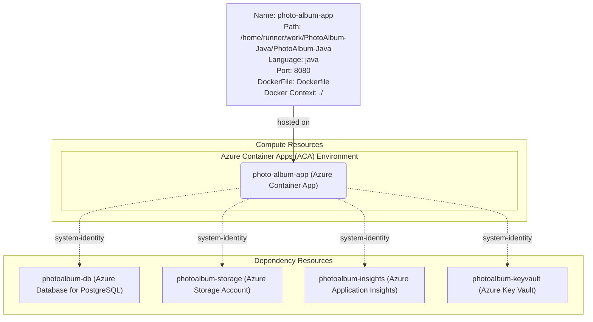

# PhotoAlbum Azure Architecture

> **Note**: To view this diagram, please install a Mermaid preview extension in your editor (e.g., "Markdown Preview Mermaid Support" or "Mermaid Chart").

## Architecture Overview

This architecture diagram illustrates the proposed Azure deployment for the PhotoAlbum Java application. The design follows cloud-native best practices with managed services, secure authentication using managed identities, and scalable compute resources.

## Architecture Diagram

## Components Description

### Compute Layer

#### Azure Container Apps (photo-album-app)
- **Purpose**: Hosts the containerized PhotoAlbum Spring Boot application
- **Configuration**:
  - Container Port: 8080
  - Language: Java
  - Base Image: Eclipse Temurin JRE
  - Build Tool: Maven
- **Benefits**:
  - Automatic scaling based on HTTP traffic
  - Built-in HTTPS and custom domain support
  - Integrated monitoring and logging
  - Zero-infrastructure management

### Data & Storage Layer

#### Azure Database for PostgreSQL (photoalbum-db)
- **Purpose**: Managed relational database for storing photo metadata and application data
- **Migration Path**: Replace Oracle DB with PostgreSQL
- **Features**:
  - Automated backups and point-in-time restore
  - High availability with zone redundancy
  - Automatic patching and updates
  - Connection pooling and performance optimization
- **Authentication**: Managed Identity (system-assigned) for secure, credential-free access

#### Azure Storage Account (photoalbum-storage)
- **Purpose**: Object storage for photo files and media assets
- **Storage Types**:
  - Blob Storage: For photo images (JPEG, PNG, etc.)
  - File Storage: For shared file access if needed
- **Features**:
  - Geo-redundant storage options
  - Automatic tiering (Hot/Cool/Archive)
  - CDN integration for fast content delivery
  - Lifecycle management policies
- **Authentication**: Managed Identity for secure access without storage keys

### Observability & Monitoring

#### Azure Application Insights (photoalbum-insights)
- **Purpose**: Application performance monitoring and diagnostics
- **Capabilities**:
  - Real-time performance metrics
  - Request and dependency tracking
  - Exception and error logging
  - Custom telemetry and events
  - User behavior analytics
  - Availability monitoring
- **Integration**: Automatic instrumentation through Java agent
- **Authentication**: Managed Identity for secure connection

### Security & Configuration

#### Azure Key Vault (photoalbum-keyvault)
- **Purpose**: Centralized secrets management and secure credential storage
- **Stored Secrets**:
  - Database connection strings
  - API keys and tokens
  - Certificate management
  - Encryption keys
- **Features**:
  - Hardware security module (HSM) backed
  - Access policies and audit logging
  - Secret rotation and versioning
  - Integration with Azure services
- **Authentication**: Managed Identity for passwordless access

## Data Flow

1. **User Request**: Users access the application through HTTPS endpoint provided by Azure Container Apps
2. **Application Processing**: Container Apps routes requests to the Spring Boot application container
3. **Database Operations**: Application queries/updates data in Azure Database for PostgreSQL using managed identity
4. **File Operations**: Photo uploads/downloads interact with Azure Storage Account blob containers
5. **Secret Retrieval**: Application retrieves configuration and secrets from Key Vault as needed
6. **Telemetry**: All operations are monitored and logged to Application Insights

## Security Features

### Managed Identities
All connections between services use Azure Managed Identities (system-assigned), eliminating the need for:
- Hardcoded credentials
- Connection string secrets
- Password rotation management

### Network Security
- Private endpoints can be configured for database and storage
- Virtual Network integration for enhanced isolation
- Network Security Groups for traffic control
- DDoS protection at the platform level

## Scalability & High Availability

### Auto-scaling
- Container Apps automatically scale based on:
  - HTTP request volume
  - CPU and memory utilization
  - Custom metrics
- Scale to zero capability for cost optimization

### High Availability
- Multi-zone deployment for Container Apps
- Database with zone-redundant configuration
- Geo-redundant storage for data durability
- Automatic failover and recovery

## Cost Optimization

- **Consumption-based pricing**: Pay only for resources used
- **Scale to zero**: Container Apps can scale down when idle
- **Storage tiering**: Automatically move less-accessed photos to cool/archive tiers
- **Reserved capacity**: Option for predictable workloads

## Deployment Considerations

### Prerequisites
- Dockerfile ready (present in repository)
- Database migration scripts prepared
- Environment variables configured
- Managed identity permissions set up

### Migration Steps
1. Provision Azure resources
2. Set up managed identities and access policies
3. Migrate database from Oracle to PostgreSQL
4. Upload existing photos to Azure Storage
5. Deploy container to Azure Container Apps
6. Configure custom domain and SSL
7. Test and validate functionality

## Technology Stack

- **Application**: Java 8 (recommend upgrading to Java 17+)
- **Framework**: Spring Boot 2.7.18 (recommend upgrading to 3.x)
- **Build Tool**: Maven
- **Container Runtime**: Docker
- **Cloud Platform**: Microsoft Azure
- **Database**: PostgreSQL (migrating from Oracle)
- **Storage**: Azure Blob Storage

## Supported Azure Services

This architecture uses Azure services from the following categories:

**Compute Hosting Options**:
- appservice
- function
- containerapp (currently used)
- staticwebapp
- aks

**Dependency Services**:
- azuredatabaseforpostgresql (currently used)
- azurestorageaccount (currently used)
- azurekeyvault (currently used)
- azureapplicationinsights (currently used)
- azureaisearch
- azureaiservices
- azurecosmosdb
- azuredatabaseformysql
- azureopenai
- azurecacheforredis
- azuresqldatabase
- azureservicebus
- azuresignalrservice
- azurevirtualnetwork
- azurewebpubsub
- azurecontainerregistry

---

*This architecture diagram can be customized based on specific requirements, traffic patterns, and budget constraints. Please review and provide feedback if adjustments are needed.*
