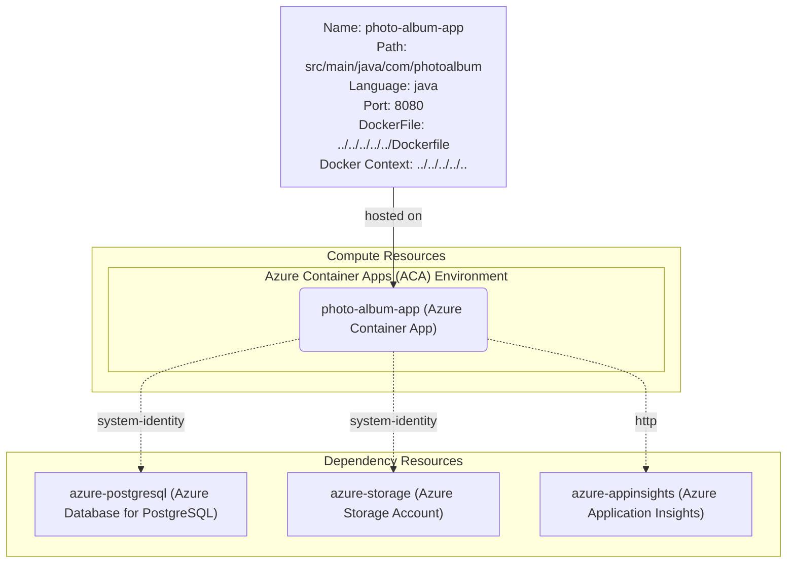

# Azure Architecture Diagram for PhotoAlbum-Java

This diagram illustrates the proposed Azure architecture for migrating the PhotoAlbum-Java application. The application is designed to run on Azure Container Apps with supporting services for database, storage, and monitoring.

## Architecture Overview

The PhotoAlbum-Java application will be deployed as a containerized workload on Azure Container Apps, connecting to various Azure services using managed identities for secure authentication.

### Components:

1. **Azure Container Apps**: Hosts the Spring Boot application (photo-album-app)
   - Port: 8080
   - Language: Java
   - Dockerfile location: ./Dockerfile
   
2. **Azure Database for PostgreSQL**: Replaces Oracle Database
   - Connection: System-assigned managed identity
   - Purpose: Store application data including photo metadata and user information

3. **Azure Storage Account**: Manages photo storage
   - Connection: System-assigned managed identity
   - Purpose: Store uploaded photos and media files

4. **Azure Application Insights**: Provides monitoring and telemetry
   - Connection: HTTP
   - Purpose: Application performance monitoring, logging, and diagnostics

## Data Flow

1. Users interact with the web application hosted on Azure Container Apps
2. The application retrieves and stores photo metadata in Azure Database for PostgreSQL
3. Photo files are uploaded to and retrieved from Azure Storage Account
4. Application telemetry and logs are sent to Azure Application Insights for monitoring

## Architecture Diagram

> **Note**: To view the diagram below, please install a Mermaid preview extension in your editor.

## Security Considerations

- **Managed Identities**: The application uses system-assigned managed identities to securely connect to PostgreSQL and Storage Account without managing credentials
- **No Hardcoded Secrets**: Database passwords and storage keys are managed through Azure Key Vault or managed identities
- **Application Insights**: Uses connection strings or managed identity for secure telemetry transmission

## Supported Technologies

### Hosting Options:
- appservice
- function
- containerapp (selected)
- staticwebapp
- aks

### Supported Azure Services for Integration:
- azureaisearch
- azureaiservices
- appservicemanagedinstance
- azureapplicationinsights (selected)
- azurebotservice
- azurecosmosdb
- azurekeyvault
- azuredatabaseformysql
- azureopenai
- azuredatabaseforpostgresql (selected)
- azureprivateendpoint
- azurecacheforredis
- azuresqldatabase
- azurestorageaccount (selected)
- azureservicebus
- azuresignalrservice
- azurevirtualnetwork
- azurewebpubsub
- azurecontainerregistry

## Next Steps

1. Review and validate the proposed architecture
2. Configure Azure resources according to this architecture
3. Update application configuration for Azure services
4. Deploy the containerized application to Azure Container Apps
5. Test connectivity and functionality in Azure environment
