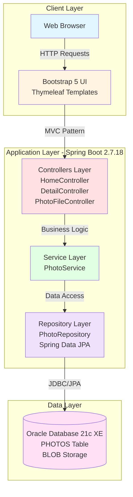
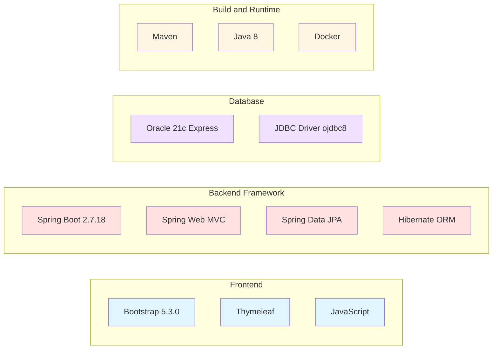
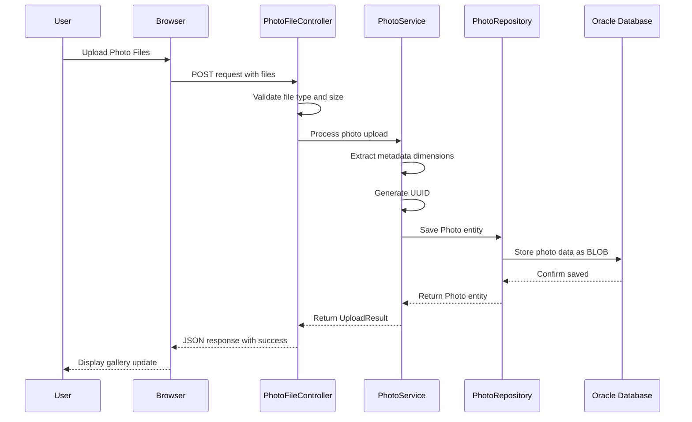
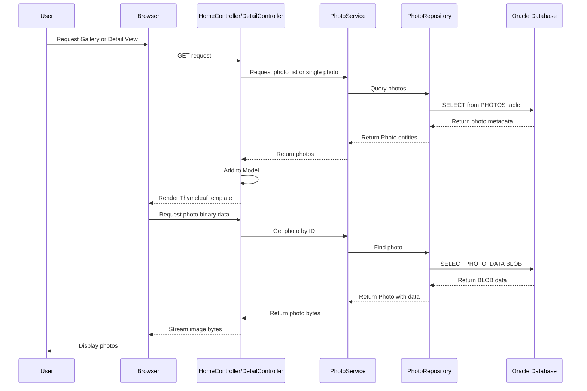
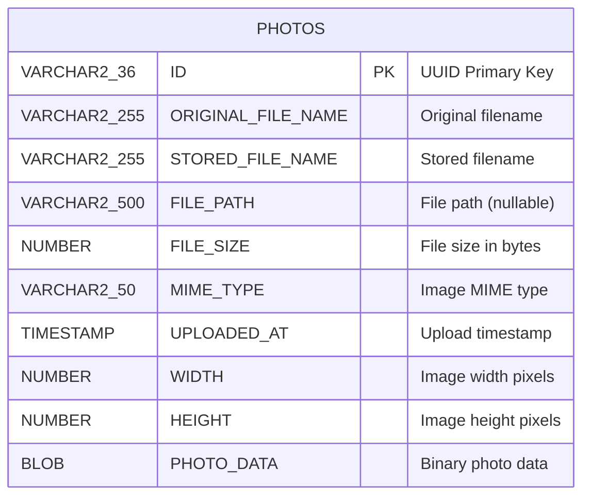
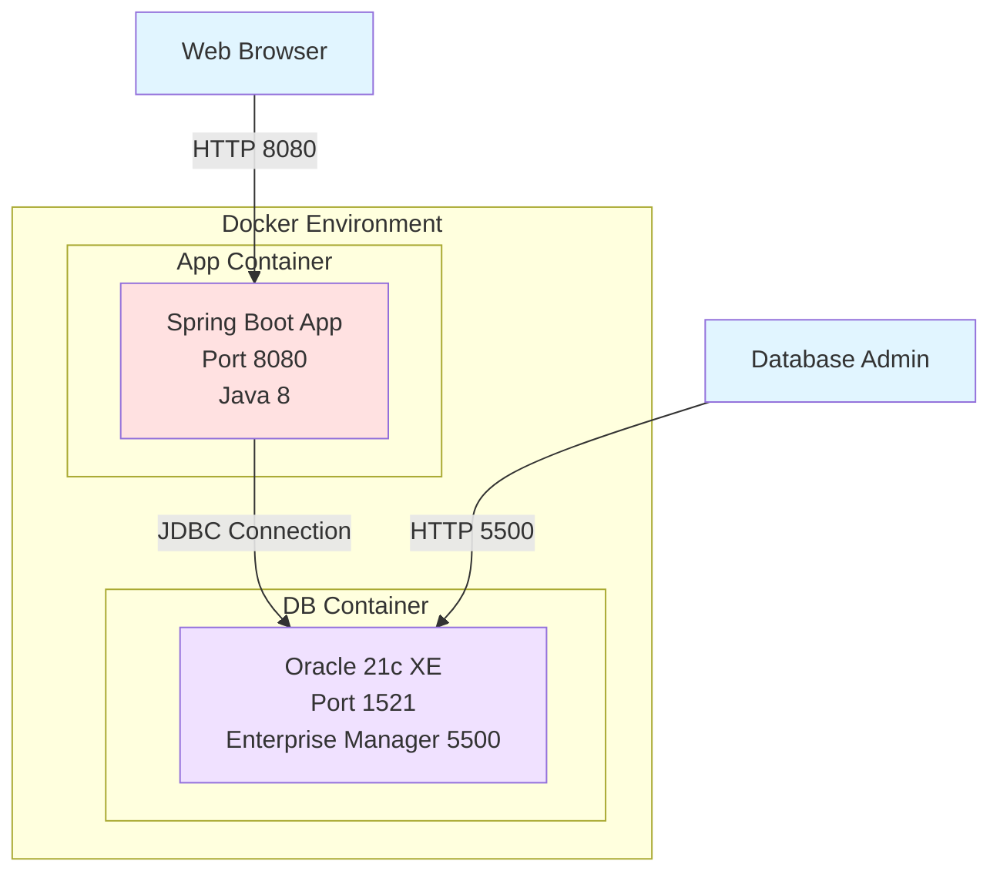

# Photo Album Application - Architecture Diagram

## Application Overview

Photo Album is a Spring Boot web application for managing and displaying photos with gallery and detail views. It uses Oracle Database for storage with BLOB-based photo persistence.

## Current Architecture Diagram

## Technology Stack

## Application Flow - Photo Upload

## Application Flow - Photo Display

## Data Model

## Key Components and Dependencies

### Spring Boot Dependencies
- **spring-boot-starter-web**: Web MVC framework
- **spring-boot-starter-thymeleaf**: Server-side templating
- **spring-boot-starter-data-jpa**: ORM and data access
- **spring-boot-starter-validation**: Input validation

### Database Dependencies
- **ojdbc8**: Oracle JDBC driver for database connectivity

### Utilities
- **commons-io (2.11.0)**: File operation utilities

## Storage Architecture

- **Photo Storage**: BLOB (Binary Large Object) in Oracle Database
- **Benefits**: 
  - No file system dependencies
  - ACID compliance
  - Simplified backup
  - Container-friendly
- **Trade-offs**: Database size increases with photo volume

## Deployment Architecture

## Configuration Management

- **Application Properties**: application.properties, application-docker.properties
- **Server Configuration**: Port 8080, UTF-8 encoding
- **Database Configuration**: Oracle connection, JPA/Hibernate settings
- **File Upload Limits**: 10MB per file, 50MB per request
- **Allowed MIME Types**: image/jpeg, image/png, image/gif, image/webp

## Assessment Summary

### Application Type
- **Framework**: Spring Boot 2.7.18
- **Pattern**: MVC (Model-View-Controller)
- **Architecture**: Layered (Controller, Service, Repository)

### Key Features
- Photo upload with drag-and-drop
- Gallery view with responsive grid
- Detail view with navigation
- BLOB-based database storage
- File validation and metadata extraction

### Technology Assessment
- **Java Version**: 1.8 (Legacy, consider upgrading to Java 11 or 17)
- **Spring Boot Version**: 2.7.18 (Mature but not latest)
- **Database**: Oracle 21c Express Edition
- **Build Tool**: Maven
- **Containerization**: Docker and Docker Compose ready
