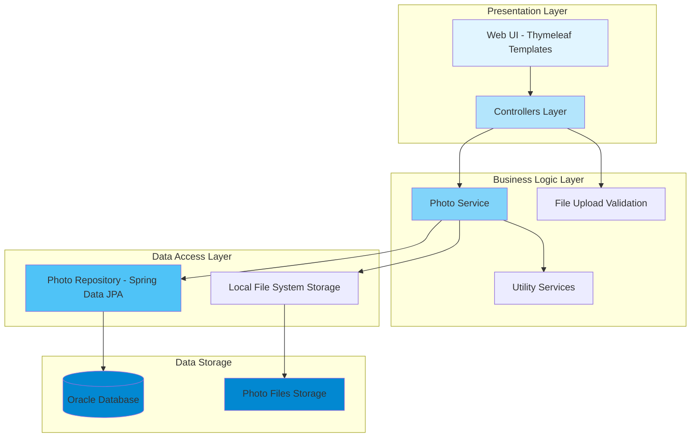
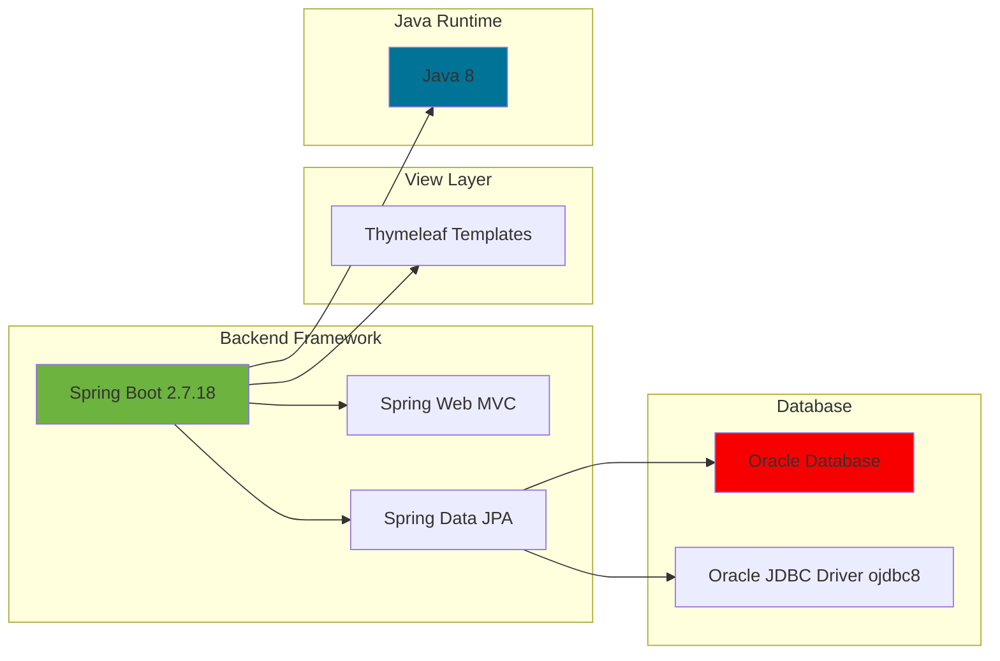

# PhotoAlbum-Java Application Architecture

## Overview

This diagram illustrates the high-level architecture of the PhotoAlbum-Java application, a Spring Boot-based photo storage and gallery system using Oracle Database.

## Current Architecture Diagram

## Technology Stack

## Application Components

### Controllers
- **HomeController**: Main landing page and gallery view
- **DetailController**: Individual photo details page
- **PhotoFileController**: File upload and management endpoints

### Services
- **PhotoService**: Business logic for photo management
  - Photo upload processing
  - File validation and storage
  - Photo retrieval and filtering

### Repository
- **PhotoRepository**: Spring Data JPA repository for database operations

### Models
- **Photo**: Entity representing photo metadata
- **UploadResult**: Result object for file upload operations

## Key Features

1. **Photo Upload**: Multi-file upload with validation
   - Maximum file size: 10MB
   - Allowed types: JPEG, PNG, GIF, WebP
   - Maximum files per upload: 10

2. **Photo Gallery**: Browse and view uploaded photos

3. **Database**: Oracle Database for metadata storage

4. **File Storage**: Local file system for photo storage

## Configuration

- **Server Port**: 8080
- **Database**: Oracle Database (FREEPDB1)
- **JPA Configuration**: DDL auto-create, SQL logging enabled
- **Character Encoding**: UTF-8

## Deployment Configuration

The application includes Docker support:
- **Dockerfile**: Container image definition
- **docker-compose.yml**: Multi-container setup with Oracle DB
- **Oracle Init Scripts**: Database initialization

## Architecture Characteristics

- **Layered Architecture**: Clear separation between presentation, business, and data layers
- **MVC Pattern**: Spring MVC for web request handling
- **ORM**: Hibernate/JPA for database operations
- **Template Engine**: Server-side rendering with Thymeleaf
- **File Upload**: Multipart form data handling with validation
- **Database**: Oracle Database for relational data storage
