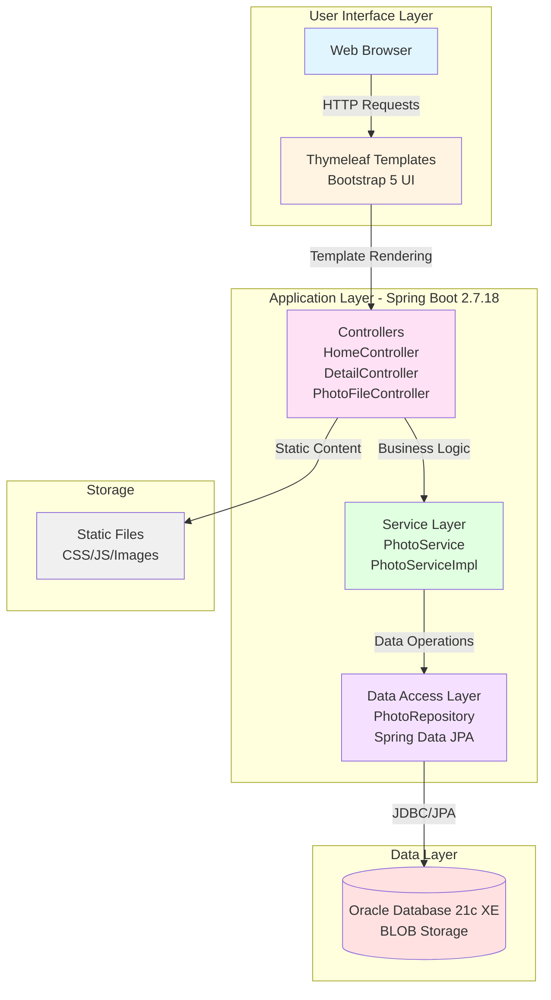
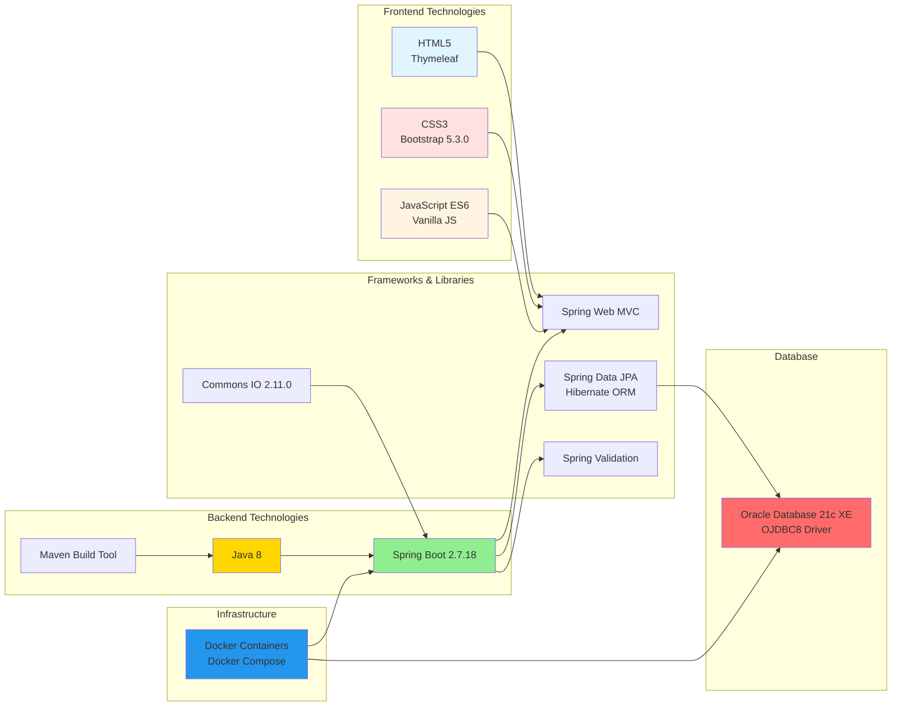
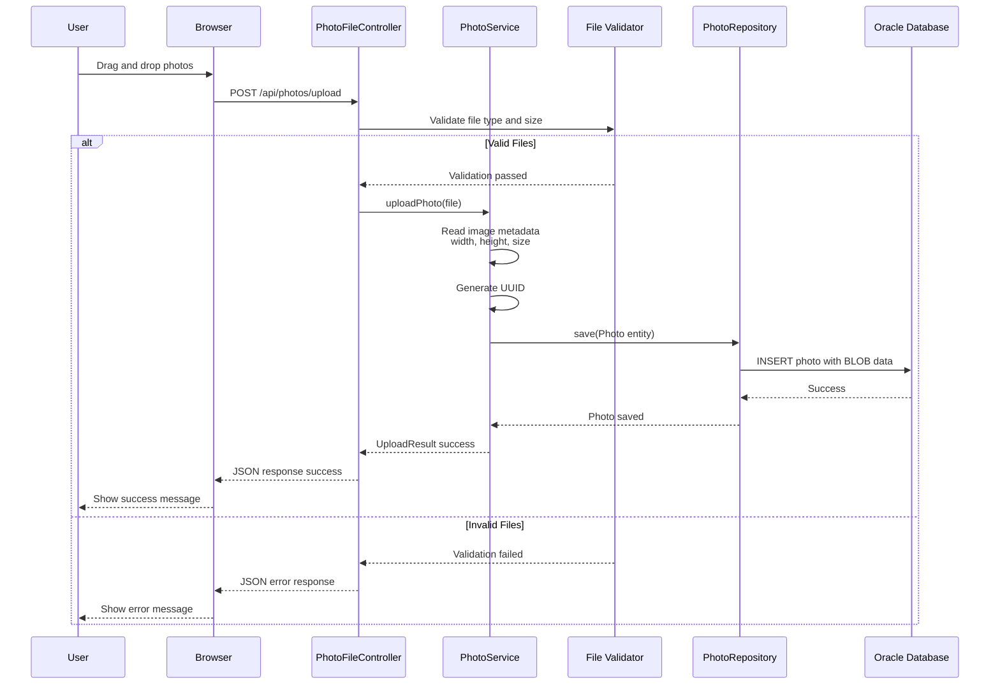
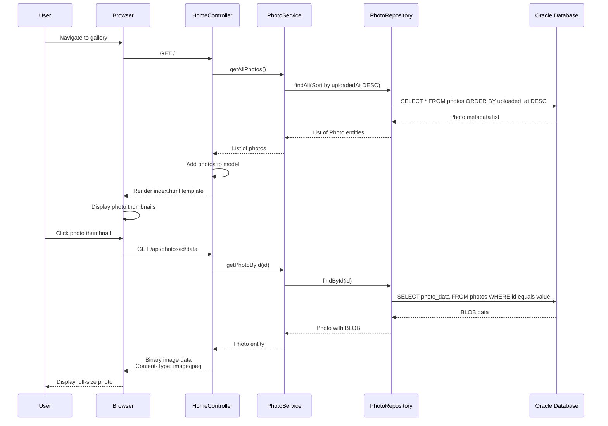
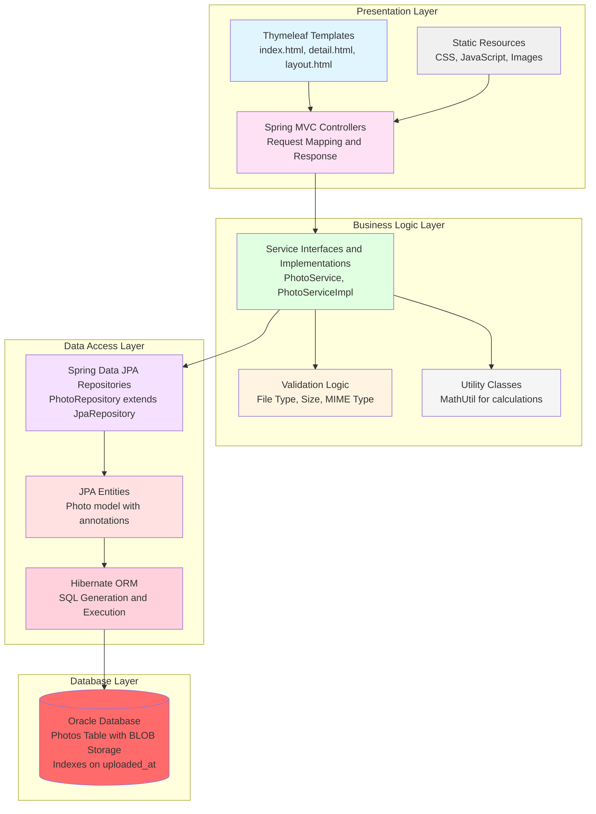
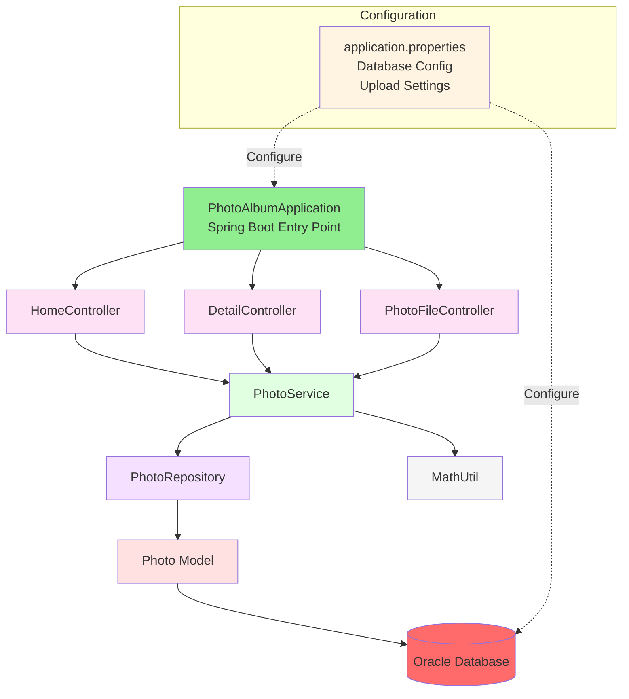
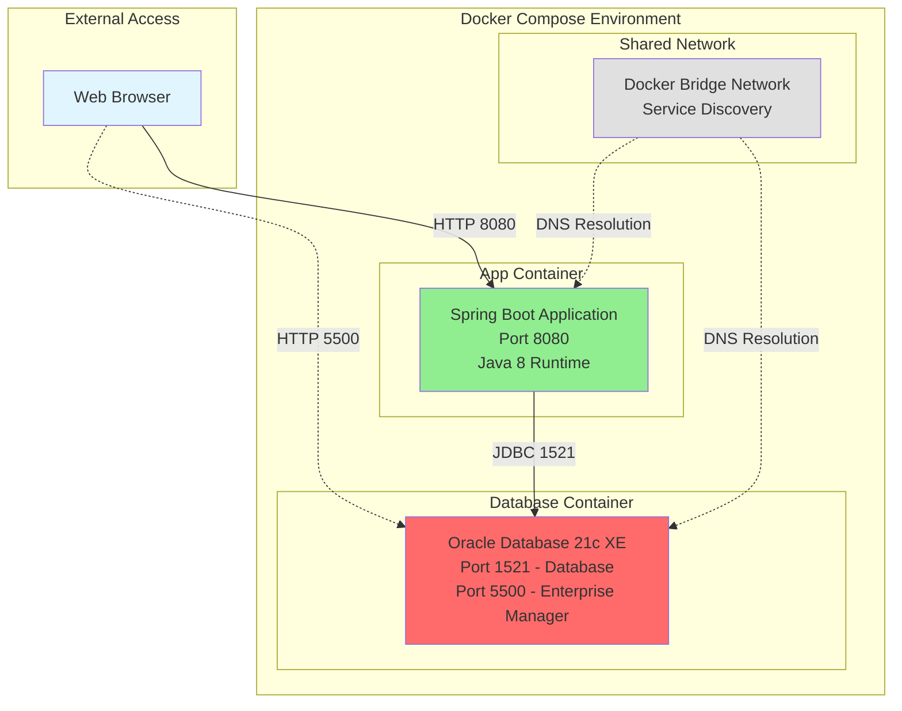

# Photo Album Application - Architecture Diagram

## Overview

This document presents the current architecture of the Photo Album Java application based on the assessment results. The application is a Spring Boot-based web application that allows users to upload, view, and manage photos stored in an Oracle database.

## Current Architecture

### High-Level System Architecture

### Technology Stack

### Data Flow - Photo Upload Process

### Data Flow - Photo Display Process

### Application Layers

### Component Dependencies

## Key Architecture Characteristics

### Current Implementation

1. **Monolithic Architecture**: Single Spring Boot application handling all concerns
2. **MVC Pattern**: Clear separation between Model, View, and Controller layers
3. **Database-Centric Storage**: Photos stored as BLOBs directly in Oracle database
4. **Session-less**: RESTful APIs with no server-side session management
5. **Containerized**: Docker and Docker Compose for deployment
6. **JPA/Hibernate**: ORM for database operations with automatic schema generation

### Technology Decisions

| Component | Technology | Version |
|-----------|-----------|---------|
| Programming Language | Java | 8 |
| Framework | Spring Boot | 2.7.18 |
| Database | Oracle Database | 21c Express Edition |
| ORM | Hibernate/JPA | Included with Spring Boot |
| Template Engine | Thymeleaf | Included with Spring Boot |
| Build Tool | Maven | 3.x |
| Frontend Framework | Bootstrap | 5.3.0 |
| JDBC Driver | Oracle OJDBC8 | Managed by Spring Boot |
| File Utilities | Commons IO | 2.11.0 |

### Data Storage Strategy

**Photo Storage**: All photos are stored as BLOB (Binary Large Object) data directly in the Oracle database.

**Benefits**:
- No file system dependencies
- ACID compliance for all operations
- Simplified backup and restore
- Perfect for containerized environments
- Consistent data management

**Trade-offs**:
- Database size grows with photo uploads
- May impact database performance at scale
- Requires adequate database storage capacity

### External Dependencies

1. **Oracle Database 21c XE**
   - Connection: JDBC via ojdbc8 driver
   - Port: 1521
   - Schema: photoalbum

2. **Static File System**
   - CSS stylesheets
   - JavaScript files
   - No photo files stored on filesystem

## Deployment Architecture

### Container Configuration

**Application Container**:
- Base Image: maven:3.8.6-openjdk-8
- Exposed Port: 8080
- Build: Multi-stage Maven build
- Dependencies: All managed in pom.xml

**Database Container**:
- Base Image: container-registry.oracle.com/database/express:21.3.0-xe
- Exposed Ports: 1521 (database), 5500 (Enterprise Manager)
- Volume: Persistent storage for database files
- Init Scripts: Automatic user and schema creation

## Assessment Summary

Based on the code analysis and assessment:

### Strengths
- Clean layered architecture with good separation of concerns
- RESTful API design for photo operations
- Comprehensive validation for file uploads
- Containerized deployment ready
- Well-structured Spring Boot application

### Areas for Consideration
- Java 8 is end-of-life; consider upgrading to Java 11, 17, or 21
- Spring Boot 2.7.x will reach end-of-support; migration to Spring Boot 3.x recommended
- Oracle Database dependency may require Azure-specific considerations
- BLOB storage approach may need review for high-volume scenarios
- No distributed caching or CDN for photo delivery

### Azure Migration Opportunities
- **Compute**: Azure App Service, Azure Container Apps, or Azure Kubernetes Service (AKS)
- **Database**: Azure Database for PostgreSQL, Azure SQL Database, or Oracle Database on Azure
- **Storage**: Consider Azure Blob Storage for photo files instead of database BLOBs
- **CDN**: Azure CDN for optimized photo delivery
- **Caching**: Azure Cache for Redis for frequently accessed photos
- **Monitoring**: Azure Application Insights for observability

---

*Generated from assessment results on February 10, 2026*
