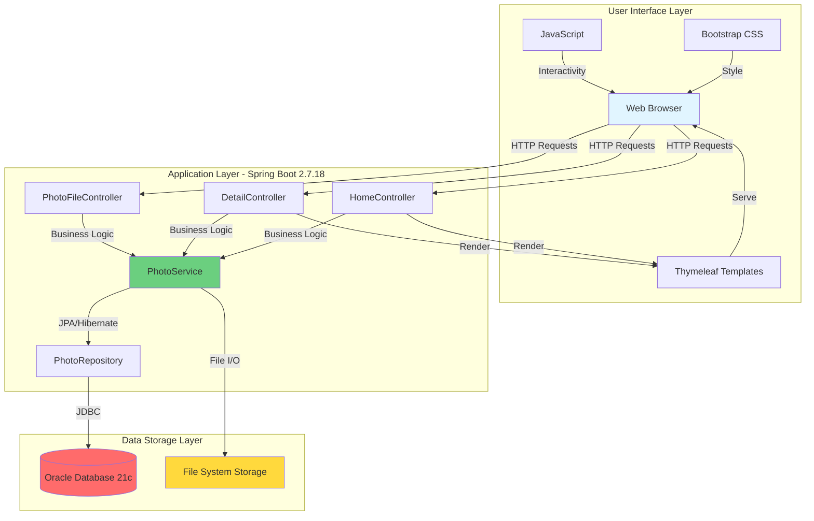
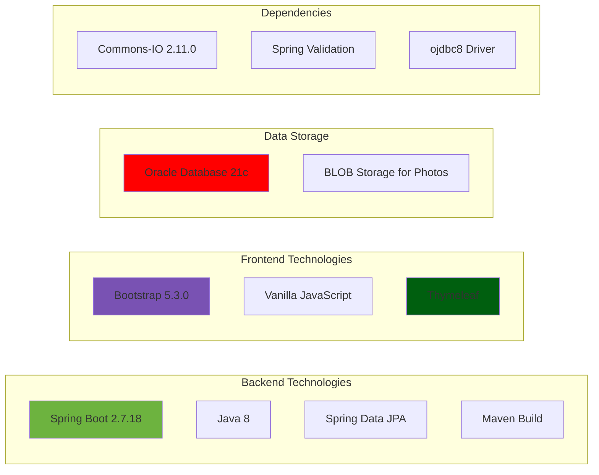
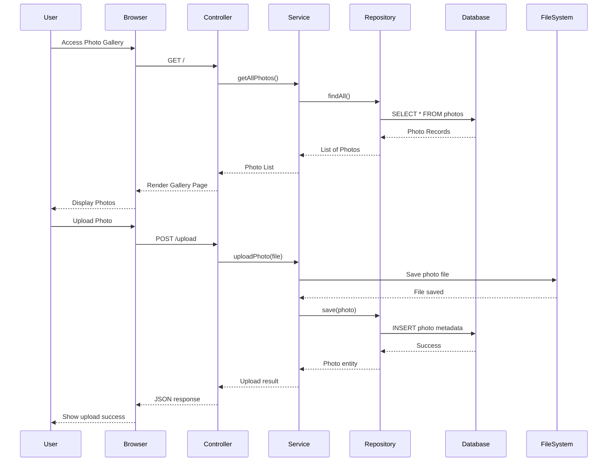

# PhotoAlbum-Java Application Architecture

## Overview

This document provides a visual representation of the PhotoAlbum-Java application architecture based on the assessment analysis.

## Current Architecture

## Technology Stack

## Application Flow

## Key Components

### Controllers (Presentation Layer)
- **HomeController**: Gallery view and photo upload functionality
- **DetailController**: Individual photo detail view with navigation
- **PhotoFileController**: Photo file serving and deletion operations

### Services (Business Logic Layer)
- **PhotoService**: Core business logic for photo management
  - Photo upload validation and processing
  - Image metadata extraction (dimensions, file size)
  - Photo retrieval and deletion operations

### Repository (Data Access Layer)
- **PhotoRepository**: Spring Data JPA repository interface
  - Database CRUD operations
  - Custom query methods for photo management

### Model (Domain Layer)
- **Photo**: Entity representing a photo with metadata
- **UploadResult**: DTO for upload operation results

## Data Storage

### Oracle Database
- Stores photo metadata (filename, size, dimensions, timestamps)
- Uses BLOB type for storing photo binary data
- Connection via JDBC driver (ojdbc8)

### File System
- Alternative storage for photo files
- Managed through PhotoService

## Configuration

### Database Configuration
- **Database**: Oracle Database 21c Express Edition
- **Connection**: JDBC thin client
- **Schema Management**: Hibernate auto DDL (create mode)
- **Credentials**: Configured in application.properties

### File Upload Configuration
- **Max File Size**: 10MB
- **Max Request Size**: 50MB
- **Allowed Types**: JPEG, PNG, GIF, WebP
- **Max Files Per Upload**: 10

## Assessment Findings Summary

Based on the AppCAT assessment, the application has:
- **Total Issues**: 7
- **Total Incidents**: 26
- **Total Effort**: 84 story points

### Issue Categories
- **Database Migration**: 6 incidents
- **Framework Upgrade**: 10 incidents
- **Java Version Upgrade**: 3 incidents
- **Local Credential**: 3 incidents
- **Spring Migration**: 4 incidents

### Severity Distribution
- **Mandatory**: 13 incidents
- **Potential**: 13 incidents

## Target Azure Services

The application can be modernized for deployment to:
1. **Azure Kubernetes Service (AKS)** - Container orchestration
2. **Azure App Service** - Managed PaaS platform
3. **Azure Container Apps** - Serverless containers

### Recommended Azure Services for Migration
- **Azure Database for PostgreSQL/MySQL** - Replace Oracle Database
- **Azure Blob Storage** - Photo file storage
- **Azure Application Insights** - Monitoring and diagnostics
- **Azure Key Vault** - Secure credential management
- **Azure Container Registry** - Container image storage
