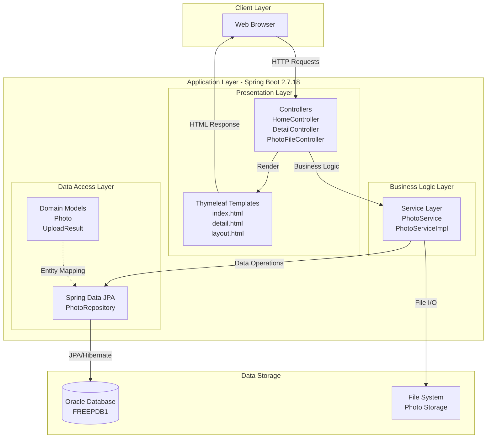
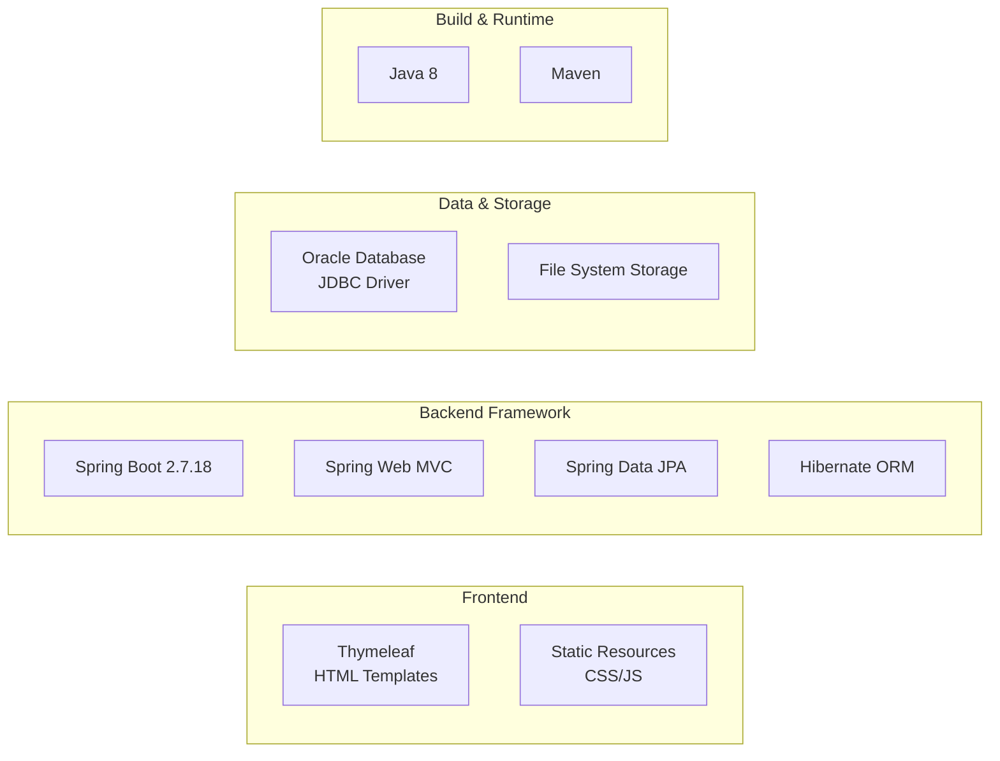
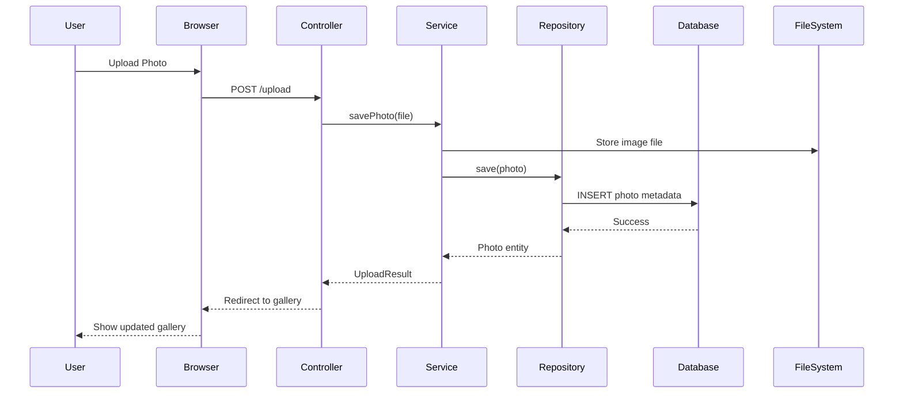

# Photo Album Application - Architecture Diagram

## Overview

This diagram illustrates the current architecture of the Photo Album application, a Spring Boot web application for photo storage and gallery management.

## Current Architecture

## Technology Stack

## Application Layers Details

### 1. Presentation Layer
- **Controllers**: Handle HTTP requests and responses
  - `HomeController`: Gallery home page
  - `DetailController`: Photo detail view
  - `PhotoFileController`: Photo upload and file operations
- **View Templates**: Thymeleaf-based HTML templates
  - Server-side rendering
  - Dynamic content generation

### 2. Business Logic Layer
- **Services**: Core business operations
  - `PhotoService`: Photo management interface
  - `PhotoServiceImpl`: Implementation of photo operations
  - File validation and processing
  - Image metadata handling

### 3. Data Access Layer
- **Repository**: Spring Data JPA repositories
  - `PhotoRepository`: Database operations for Photo entities
- **Models**: Domain entities
  - `Photo`: Photo entity with metadata
  - `UploadResult`: Upload operation results

## Data Flow

## Key Technologies

| Layer | Technology | Version |
|-------|-----------|---------|
| **Runtime** | Java | 8 |
| **Framework** | Spring Boot | 2.7.18 |
| **Web** | Spring Web MVC | - |
| **Template Engine** | Thymeleaf | - |
| **ORM** | Hibernate (via Spring Data JPA) | - |
| **Database** | Oracle Database | - |
| **JDBC Driver** | ojdbc8 | - |
| **Build Tool** | Maven | - |
| **File Processing** | Commons IO | 2.11.0 |

## Database Configuration

- **Database**: Oracle Database
- **Connection**: `jdbc:oracle:thin:@oracle-db:1521/FREEPDB1`
- **ORM**: Hibernate with Oracle Dialect
- **DDL**: Auto-create schema on startup

## File Upload Configuration

- **Max File Size**: 10MB
- **Max Request Size**: 50MB
- **Allowed MIME Types**: image/jpeg, image/png, image/gif, image/webp
- **Max Files per Upload**: 10

## Application Characteristics

### Current State
- ✅ Monolithic Spring Boot application
- ✅ Traditional MVC architecture
- ✅ Server-side rendering with Thymeleaf
- ✅ Oracle Database for persistence
- ✅ File system storage for images
- ✅ Java 8 runtime

### Assessment Insights

Based on the AppCAT assessment, the application has:
- **7 total issues** identified for Azure migration
- **26 incidents** across the codebase
- **84 story points** of estimated effort

Key migration considerations:
1. **Database Migration** (6 incidents): Oracle to Azure-compatible database
2. **Framework Upgrade** (10 incidents): Spring Boot modernization
3. **Java Version Upgrade** (3 incidents): Java 8 to modern LTS version
4. **Credential Management** (3 incidents): Local credentials to Azure Key Vault
5. **Spring Migration** (4 incidents): Azure-specific optimizations

## Azure Migration Targets

The assessment evaluated readiness for:
- **Azure Kubernetes Service (AKS)**: Container orchestration
- **Azure App Service**: Platform-as-a-Service hosting
- **Azure Container Apps**: Serverless container platform

## Notes

This diagram represents the current architecture of the Photo Album application. For migration planning and modernization recommendations, refer to the assessment report at `.github/modernize/report.json`.
