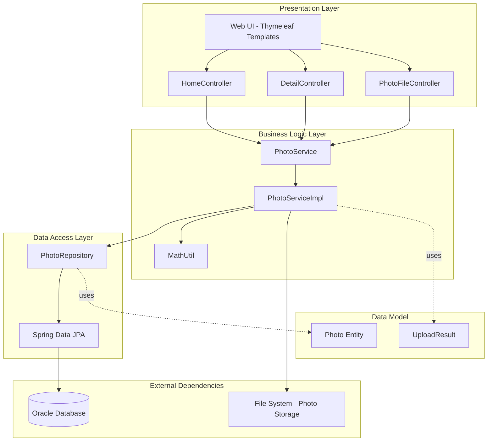
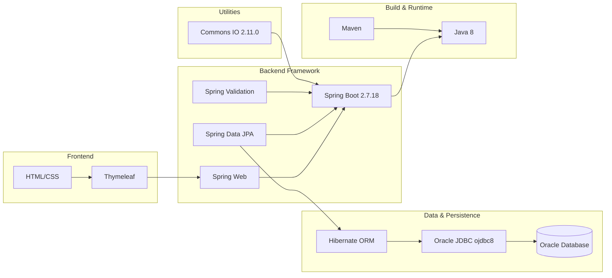
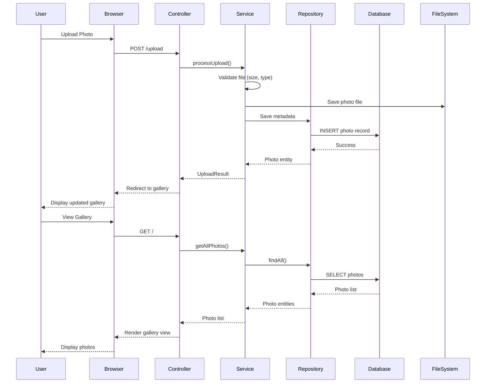

# Photo Album Application - Architecture Diagram

## Application Overview

**Application Type:** Spring Boot Web Application  
**Primary Language:** Java 8  
**Framework:** Spring Boot 2.7.18  
**Architecture Pattern:** MVC (Model-View-Controller)  

## High-Level Architecture

## Component Details

### Presentation Layer
- **Technology:** Spring MVC + Thymeleaf
- **Controllers:**
  - `HomeController` - Main gallery view
  - `DetailController` - Photo detail view
  - `PhotoFileController` - File upload/download operations
- **Port:** 8080

### Business Logic Layer
- **Service:** `PhotoService` interface with `PhotoServiceImpl` implementation
- **Utilities:** `MathUtil` for calculations
- **Validation:** File size and MIME type validation
  - Max file size: 10MB
  - Allowed types: JPEG, PNG, GIF, WebP
  - Max files per upload: 10

### Data Access Layer
- **Technology:** Spring Data JPA
- **Repository:** `PhotoRepository` - CRUD operations for Photo entities
- **ORM:** Hibernate with Oracle dialect

### Data Model
- **Photo Entity:** Main domain model for photo metadata
- **UploadResult:** DTO for upload operations

### External Dependencies
- **Database:** Oracle Database (FREEPDB1)
  - Connection: jdbc:oracle:thin:@oracle-db:1521/FREEPDB1
  - Driver: Oracle JDBC (ojdbc8)
- **File System:** Local file storage for photo files

## Technology Stack

## Data Flow

## Key Dependencies

| Category | Technology | Version | Purpose |
|----------|-----------|---------|---------|
| Framework | Spring Boot | 2.7.18 | Application framework |
| Web | Spring Web | 2.7.18 | REST & MVC |
| Template | Thymeleaf | 2.7.18 | Server-side rendering |
| ORM | Spring Data JPA | 2.7.18 | Data persistence |
| Database | Oracle JDBC | Latest | Database connectivity |
| Validation | Spring Validation | 2.7.18 | Input validation |
| File I/O | Commons IO | 2.11.0 | File operations |
| Runtime | Java | 1.8 | JVM runtime |

## Architecture Characteristics

- **Layered Architecture:** Clear separation between presentation, business, and data layers
- **MVC Pattern:** Controllers handle HTTP requests, Services contain business logic
- **Repository Pattern:** Data access abstraction through Spring Data JPA
- **File Storage:** Photos stored in file system, metadata in Oracle database
- **Validation:** Multi-level validation (file size, MIME type, quantity)
- **RESTful Controllers:** HTTP-based API for photo operations

## Current State Summary

✅ **Strengths:**
- Clean layered architecture
- Standard Spring Boot patterns
- Separation of concerns
- Input validation present

⚠️ **Considerations for Cloud Migration:**
- Oracle Database dependency (consider Azure SQL or PostgreSQL)
- Local file system storage (consider Azure Blob Storage)
- Java 8 runtime (consider upgrading to Java 11 or 17)
- Spring Boot 2.7.x (consider upgrading to 3.x for Spring Boot)
- Single-instance file storage (not cloud-native)

---

*Generated from application assessment on 2026-02-11*
