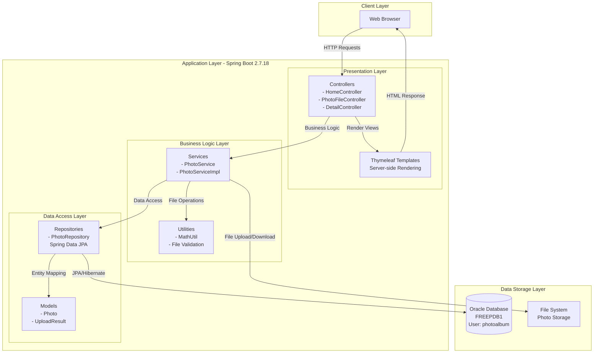
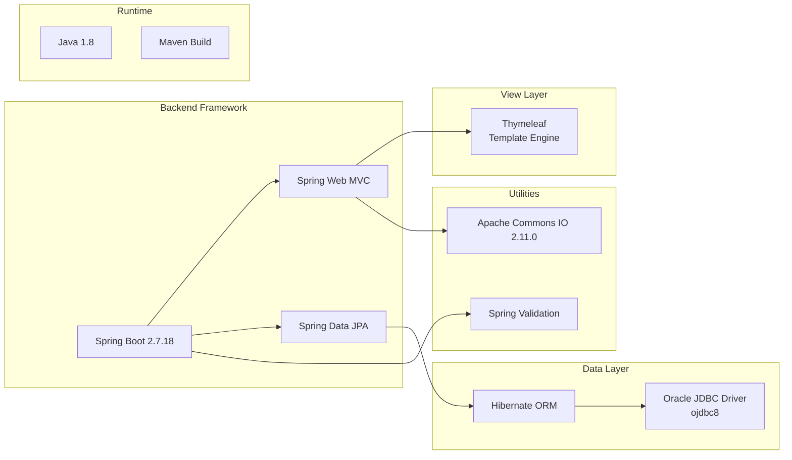
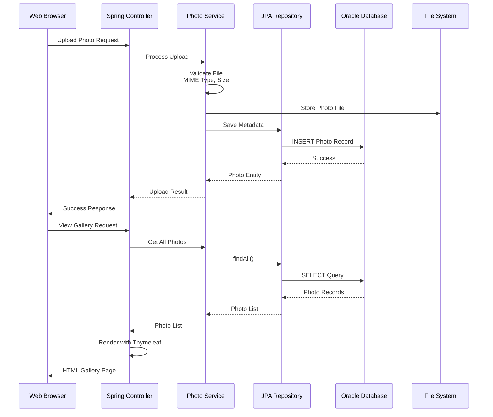

# Photo Album Application - Architecture Diagram

## Overview

This diagram illustrates the current architecture of the Photo Album Java application based on the assessment analysis.

## Current Architecture

## Technology Stack

## Data Flow

## Key Components

### 1. Presentation Layer
- **Controllers**: Handle HTTP requests and responses
  - `HomeController`: Gallery and home page
  - `PhotoFileController`: Photo upload/download operations
  - `DetailController`: Individual photo details
- **Thymeleaf Templates**: Server-side HTML rendering

### 2. Business Logic Layer
- **Services**: Core business logic and validation
  - `PhotoService`: Photo management operations
  - File validation (MIME type, size limits)
  - Upload/download processing

### 3. Data Access Layer
- **Repositories**: Spring Data JPA repositories
  - `PhotoRepository`: Database operations for Photo entity
- **Models**: JPA entities
  - `Photo`: Photo metadata entity
  - `UploadResult`: Upload operation result

### 4. Data Storage
- **Oracle Database**: Relational database for metadata
  - Connection: `jdbc:oracle:thin:@oracle-db:1521/FREEPDB1`
  - User: photoalbum
- **File System**: Physical storage for photo files
  - Max file size: 10MB
  - Max request size: 50MB
  - Allowed types: JPEG, PNG, GIF, WebP

## Configuration

### Application Settings
- **Server Port**: 8080
- **Character Encoding**: UTF-8
- **File Upload Limits**:
  - Max file size: 10MB (10,485,760 bytes)
  - Max request size: 50MB
  - Max files per upload: 10
  - Allowed MIME types: image/jpeg, image/png, image/gif, image/webp

### Database Configuration
- **Database**: Oracle Database (FREEPDB1)
- **JPA/Hibernate**: 
  - DDL Auto: create
  - Show SQL: true
  - Dialect: OracleDialect

## Assessment Findings Summary

Based on the AppCAT assessment report:

- **Total Issues**: 7
- **Total Incidents**: 26
- **Total Effort**: 84 story points

### Issue Categories:
- **Database Migration**: 6 incidents
- **Framework Upgrade**: 10 incidents (Spring Boot upgrade recommended)
- **Java Version Upgrade**: 3 incidents (Java 8 to modern LTS)
- **Local Credential**: 3 incidents (credentials in config files)
- **Spring Migration**: 4 incidents

### Severity Breakdown:
- **Mandatory**: 13 incidents (must fix for Azure migration)
- **Potential**: 13 incidents (recommended improvements)

## Migration Considerations for Azure

### Recommended Azure Services:
1. **Azure App Service**: Best for Spring Boot web applications
2. **Azure Container Apps**: For containerized deployment
3. **Azure Kubernetes Service (AKS)**: For advanced orchestration

### Key Migration Tasks:
1. **Database Migration**: Oracle DB to Azure SQL/PostgreSQL
2. **Framework Upgrade**: Spring Boot 2.7.18 to latest 3.x
3. **Java Upgrade**: Java 8 to Java 17 or 21 (LTS)
4. **Configuration Management**: Externalize credentials using Azure Key Vault
5. **File Storage**: Migrate to Azure Blob Storage from local file system
6. **Logging & Monitoring**: Integrate Azure Application Insights

## Architecture Layers Summary

| Layer | Technology | Purpose |
|-------|-----------|---------|
| Presentation | Spring MVC + Thymeleaf | HTTP request handling and HTML rendering |
| Business Logic | Spring Services | Photo management and validation |
| Data Access | Spring Data JPA + Hibernate | ORM and database operations |
| Database | Oracle Database | Metadata persistence |
| File Storage | Local File System | Photo file storage |

---

*Diagram generated from application assessment on 2026-02-10*
