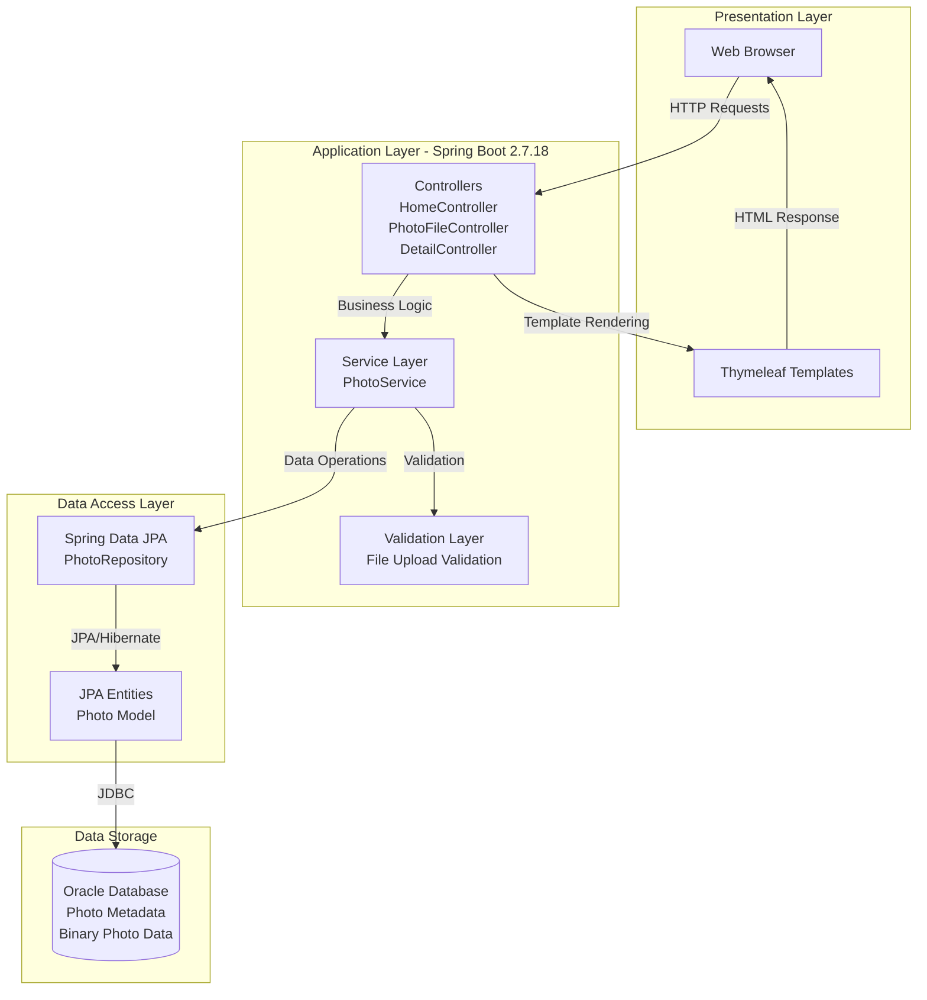
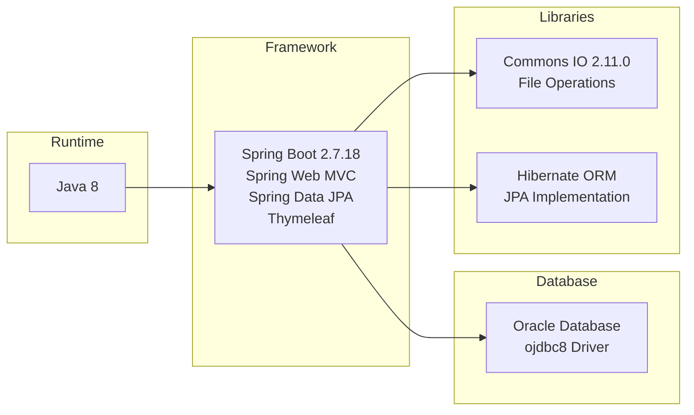
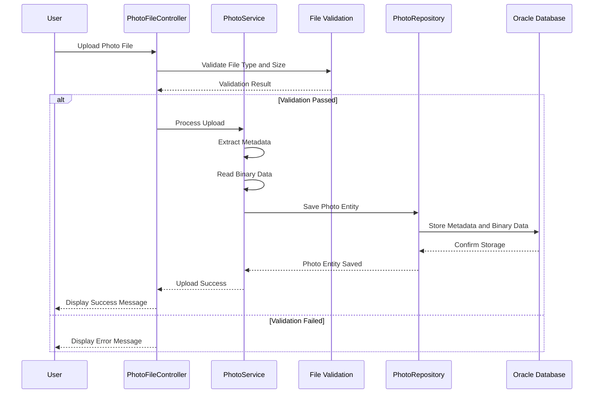

# Photo Album Application - Architecture Diagram

This diagram represents the current architecture of the Photo Album Java application based on assessment analysis.

## Application Overview

The Photo Album is a Spring Boot web application that allows users to upload, store, and view photos. It uses Oracle Database for data persistence and stores photo binary data directly in the database.

## High-Level Architecture

## Technology Stack

## Data Flow - Photo Upload Process

## Key Components

### 1. Controllers
- **HomeController**: Displays photo gallery homepage
- **PhotoFileController**: Handles photo upload operations
- **DetailController**: Shows individual photo details

### 2. Service Layer
- **PhotoService**: Business logic for photo management
  - File validation
  - Metadata extraction
  - Photo storage coordination

### 3. Data Access
- **PhotoRepository**: Spring Data JPA repository
- **Photo Entity**: JPA entity with photo metadata and binary data

### 4. Storage
- **Oracle Database**: Stores both metadata and binary photo data
  - Uses BLOB storage for photo binary data
  - Indexed by upload timestamp for efficient retrieval

## Configuration Highlights

- **Server Port**: 8080
- **Max File Upload Size**: 10MB per file
- **Max Request Size**: 50MB
- **Allowed MIME Types**: image/jpeg, image/png, image/gif, image/webp
- **Max Files Per Upload**: 10 files
- **Database**: Oracle Database (jdbc:oracle:thin)
- **JPA DDL**: create (auto-create tables)

## Current State Analysis

### Strengths
- Well-structured Spring Boot application with clear layer separation
- Uses Spring Data JPA for database abstraction
- Comprehensive validation for file uploads
- Binary storage in database for simplified deployment

### Considerations for Azure Migration
- **Java Version**: Currently using Java 8 (consider upgrading to Java 11, 17, or 21)
- **Spring Boot Version**: Using 2.7.18 (consider upgrading to Spring Boot 3.x)
- **Database**: Oracle Database (consider migrating to Azure Database for PostgreSQL or Azure SQL)
- **File Storage**: Binary data in database (consider migrating to Azure Blob Storage for scalability)
- **Compute Target**: Can be deployed to:
  - Azure App Service
  - Azure Container Apps
  - Azure Kubernetes Service (AKS)

---

*Generated from application assessment on 2026-02-11*
