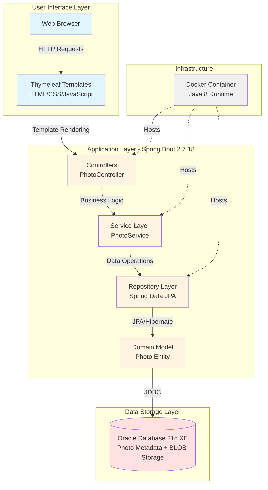
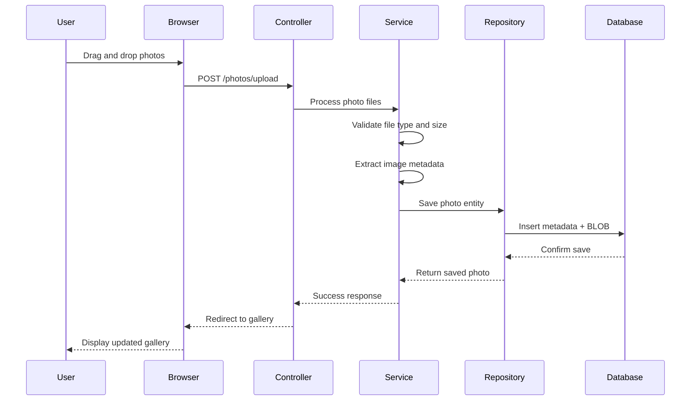
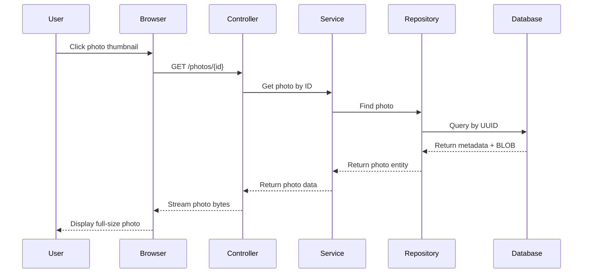

# PhotoAlbum-Java Application Architecture Diagram

## Current Architecture (As-Is)

This diagram shows the current architecture of the PhotoAlbum-Java application as analyzed from the codebase.

## Technology Stack

| Layer | Technologies |
|-------|-------------|
| **Frontend** | Thymeleaf, Bootstrap 5.3.0, Vanilla JavaScript |
| **Backend Framework** | Spring Boot 2.7.18, Spring Web, Spring Data JPA |
| **Programming Language** | Java 1.8 |
| **Database** | Oracle Database 21c Express Edition |
| **Build Tool** | Maven |
| **Runtime** | Docker, Docker Compose |
| **Web Server** | Embedded Tomcat |

## Architecture Layers

### 1. User Interface Layer
- **Thymeleaf Templates**: Server-side rendering for photo gallery and upload views
- **Static Resources**: CSS, JavaScript for drag-and-drop upload, gallery navigation
- **Bootstrap 5**: Responsive design framework

### 2. Application Layer (Spring Boot)
- **Controllers**: Handle HTTP requests, manage photo upload/download/delete operations
- **Services**: Business logic for photo processing, validation, storage
- **Repositories**: Data access using Spring Data JPA
- **Models**: Photo entity with metadata (filename, size, MIME type, dimensions, upload timestamp)

### 3. Data Storage Layer
- **Oracle Database 21c XE**: 
  - Stores photo metadata in relational tables
  - Stores photo binary data as BLOBs
  - Provides ACID transactions
  - Uses UUID-based primary keys

### 4. Infrastructure Layer
- **Docker Containers**:
  - Application container (Java 8 + Spring Boot)
  - Oracle Database container
- **Docker Compose**: Orchestrates multi-container setup

## Data Flow

### Photo Upload Flow

### Photo Display Flow

## Key Components

### Photo Entity
- **ID**: UUID (36 characters)
- **Original Filename**: User's original file name
- **Stored Filename**: Internal storage name
- **File Size**: Size in bytes
- **MIME Type**: image/jpeg, image/png, image/gif, image/webp
- **Dimensions**: Width and height in pixels
- **Upload Timestamp**: When photo was uploaded
- **Photo Data**: BLOB containing binary image data

### File Upload Configuration
- **Max File Size**: 10 MB per file
- **Max Request Size**: 50 MB total
- **Allowed Types**: JPEG, PNG, GIF, WebP
- **Max Files Per Upload**: 10 files

## External Dependencies

### Runtime Dependencies
- Oracle JDBC Driver (ojdbc8)
- Spring Boot Starters (Web, Data JPA, Thymeleaf, Validation)
- Apache Commons IO
- Hibernate (via Spring Boot)

### Development Dependencies
- Spring Boot DevTools
- H2 Database (for testing)
- Spring Boot Test

## Architecture Patterns

1. **Layered Architecture**: Clear separation of concerns (Controller → Service → Repository → Database)
2. **MVC Pattern**: Model-View-Controller for web application structure
3. **Repository Pattern**: Data access abstraction via Spring Data JPA
4. **Dependency Injection**: Spring IoC container for component management
5. **BLOB Storage**: Database-centric storage for photos

## Current Limitations

1. **Java Version**: Java 1.8 is outdated and not recommended for Azure services
2. **BLOB Storage in Database**: Not optimal for large-scale photo storage
3. **Oracle Database**: Not a managed Azure service (requires migration)
4. **Hardcoded Credentials**: Security risk for production deployments
5. **Single Container**: No horizontal scaling capabilities

## Migration Considerations

### For Azure Migration
The current architecture needs the following changes:

1. **Compute**: Move to Azure Container Apps, App Service, or AKS
2. **Storage**: Migrate photo BLOBs to Azure Blob Storage
3. **Database**: Migrate to Azure Database for PostgreSQL or Azure SQL Database
4. **Security**: Implement Azure Key Vault for secrets management
5. **Java Upgrade**: Upgrade to Java 11, 17, or 21
6. **Monitoring**: Add Azure Application Insights

---

*Generated from application assessment on 2026-02-10*  
*Source: PhotoAlbum-Java repository analysis*
