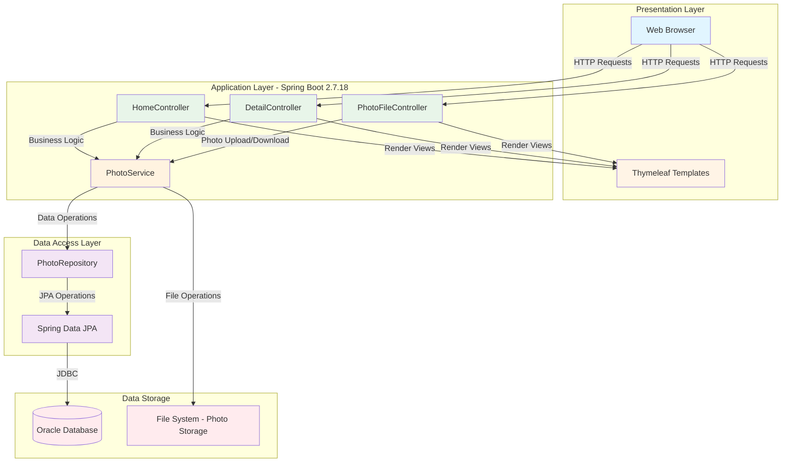

# PhotoAlbum Application Architecture Diagram

This diagram shows the high-level architecture of the PhotoAlbum Java application based on the assessment analysis.

## Application Architecture

## Technology Stack

### Framework & Runtime
- **Framework**: Spring Boot 2.7.18
- **Java Version**: Java 8 (JDK 1.8)
- **Build Tool**: Maven

### Web Layer
- **Web Framework**: Spring MVC (spring-boot-starter-web)
- **Template Engine**: Thymeleaf
- **REST Controller**: Spring REST

### Data Layer
- **ORM**: Spring Data JPA with Hibernate
- **Database**: Oracle Database (Oracle JDBC Driver - ojdbc8)
- **Database Dialect**: OracleDialect
- **Connection**: JDBC (jdbc:oracle:thin)

### File Processing
- **File Upload**: Spring Multipart (max 10MB per file, 50MB per request)
- **File Operations**: Apache Commons IO 2.11.0
- **Image Processing**: Spring Boot JSON Starter
- **Allowed Formats**: JPEG, PNG, GIF, WebP

### Additional Libraries
- **Validation**: Spring Boot Validation
- **Development**: Spring Boot DevTools
- **Testing**: Spring Boot Test, H2 Database (test scope)

## Component Descriptions

### Presentation Layer
- **Web Browser**: User interface for accessing the photo album
- **Thymeleaf Templates**: Server-side HTML rendering engine

### Application Layer (Controllers & Services)
- **HomeController**: Main landing page and photo gallery display
- **DetailController**: Individual photo detail views
- **PhotoFileController**: Handles photo upload and download operations
- **PhotoService**: Business logic for photo management

### Data Access Layer
- **PhotoRepository**: Spring Data JPA repository for database operations
- **Spring Data JPA**: Abstraction layer for data persistence

### Data Storage
- **Oracle Database**: Primary data store for photo metadata
- **File System**: Physical storage for photo files

## Key Features
- Photo upload with validation (size, type, count limits)
- Photo gallery display
- Photo detail viewing
- File system storage with database metadata tracking
- Multi-file upload support (up to 10 files per request)

## Architecture Pattern
- **Pattern**: Traditional 3-tier MVC architecture
- **Layer 1**: Presentation (Thymeleaf + Controllers)
- **Layer 2**: Business Logic (Services)
- **Layer 3**: Data Access (Repositories + JPA)

## Deployment Configuration
- **Server Port**: 8080
- **Character Encoding**: UTF-8
- **Database**: Oracle Database running on oracle-db:1521
- **Schema**: FREEPDB1
- **Hibernate DDL**: create (auto-create schema)
