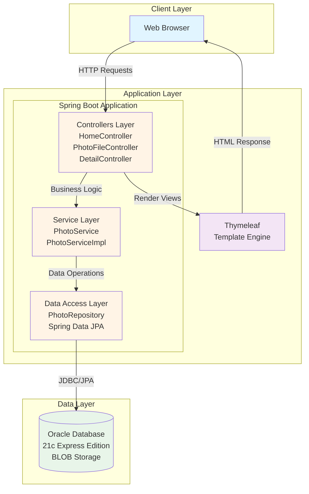
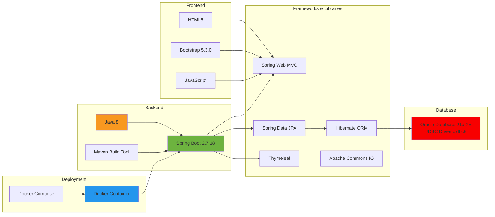
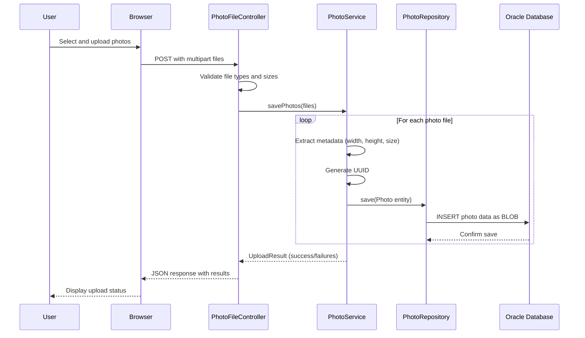
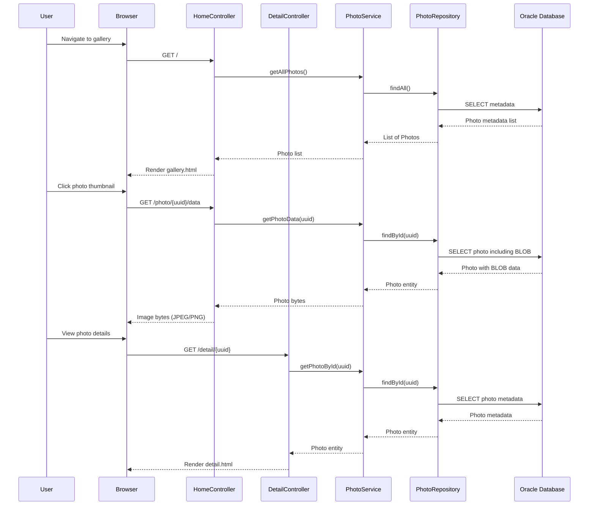
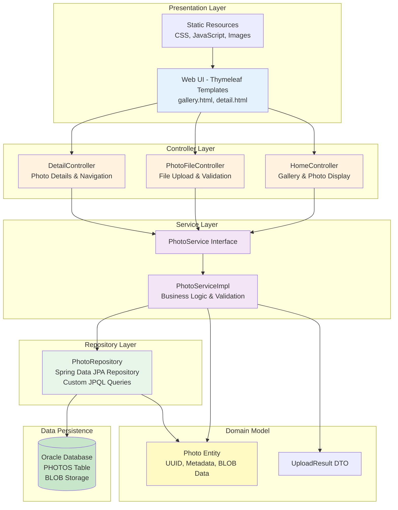

# Photo Album Application - Architecture Diagram

## Current Architecture Overview

This diagram shows the high-level architecture of the Photo Album Java application based on the assessment results.

## Technology Stack

## Data Flow - Photo Upload Process

## Data Flow - Photo Display Process

## Application Architecture Layers

## Key Components

### Application Components

- **Controllers**: Handle HTTP requests and responses
  - `HomeController`: Gallery view and photo data endpoints
  - `PhotoFileController`: Photo upload with validation
  - `DetailController`: Individual photo details and navigation

- **Service Layer**: Business logic and orchestration
  - `PhotoService`: Interface defining photo operations
  - `PhotoServiceImpl`: Implementation with validation and metadata extraction

- **Repository Layer**: Data access abstraction
  - `PhotoRepository`: Spring Data JPA repository with custom queries
  - Extends `JpaRepository` for standard CRUD operations

- **Domain Model**:
  - `Photo`: JPA entity with UUID, metadata fields, and BLOB data
  - `UploadResult`: DTO for upload operation results

### Technology Components

- **Spring Boot 2.7.18**: Application framework (Java 8)
- **Spring Web MVC**: RESTful controllers and request handling
- **Spring Data JPA**: Repository pattern and data access
- **Hibernate**: ORM for database interactions
- **Thymeleaf**: Server-side template engine
- **Oracle Database 21c XE**: Relational database with BLOB storage
- **Oracle JDBC Driver (ojdbc8)**: Database connectivity
- **Apache Commons IO**: File operations utilities
- **Bootstrap 5.3.0**: Frontend UI framework
- **Maven**: Build and dependency management

### Data Storage

- **Oracle Database 21c Express Edition**
  - Connection: JDBC thin client
  - Schema: `photoalbum` user
  - Table: `PHOTOS` with BLOB column for image data
  - Indexes: Uploaded timestamp for chronological ordering

### Deployment

- **Docker**: Application containerization
- **Docker Compose**: Multi-container orchestration (app + database)
- **Port 8080**: Application HTTP endpoint
- **Port 1521**: Oracle database connection

## Key Features

1. **Photo Upload**
   - Drag-and-drop and click-to-upload interface
   - Multi-file upload support (max 10 files)
   - File validation: type (JPEG, PNG, GIF, WebP) and size (max 10MB)
   - Metadata extraction: width, height, file size
   - UUID generation for unique identification

2. **Photo Gallery**
   - Responsive grid layout
   - Thumbnail display with metadata
   - Photo count and sorting by upload date
   - Delete functionality

3. **Photo Details**
   - Full-size photo display
   - Metadata display (dimensions, size, aspect ratio, timestamp)
   - Previous/Next navigation
   - Delete functionality

4. **Data Storage**
   - Photos stored as BLOBs in Oracle Database
   - No file system dependencies
   - ACID compliance for operations
   - Simplified backup and migration

## Assessment Summary

### Current State

- **Framework**: Spring Boot 2.7.18 with Java 8
- **Database**: Oracle Database 21c Express Edition
- **Architecture**: Traditional 3-tier web application
- **Storage**: Database BLOB storage (in-database photo storage)
- **Deployment**: Docker containers with Docker Compose

### Architecture Characteristics

- **Monolithic**: Single deployable unit
- **Stateless**: Application server can scale horizontally
- **Database-Centric**: All data including photos stored in database
- **Container-Ready**: Already containerized with Docker

### Considerations for Azure Migration

Based on the assessment, key considerations for migrating to Azure:

1. **Compute Services**
   - Azure App Service (PaaS, easiest migration)
   - Azure Container Apps (container-native, modern)
   - Azure Kubernetes Service (enterprise scale)

2. **Database Options**
   - Azure Database for PostgreSQL (recommended for migration from Oracle)
   - Azure SQL Database (alternative relational database)
   - Maintain Oracle via Azure VM (lift-and-shift)

3. **Storage Optimization**
   - Consider Azure Blob Storage for photos (more scalable than database BLOBs)
   - Keep metadata in relational database
   - Leverage Azure CDN for image delivery

4. **Modernization Opportunities**
   - Upgrade to Java 17 or 21 (LTS versions)
   - Upgrade to Spring Boot 3.x
   - Implement Azure services (Key Vault, Application Insights)
   - Add authentication with Azure AD

---

*Generated from AppCAT assessment results*
