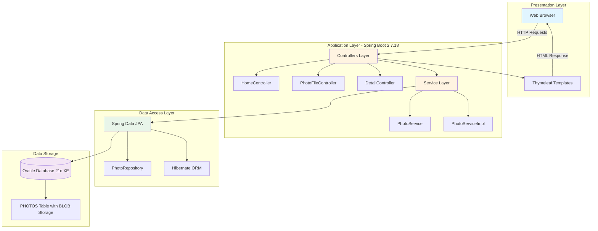
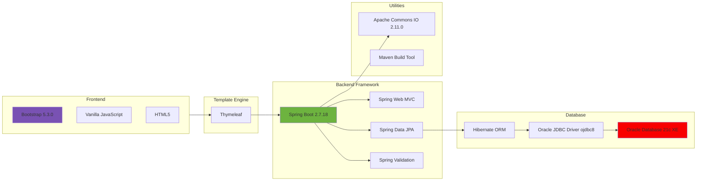
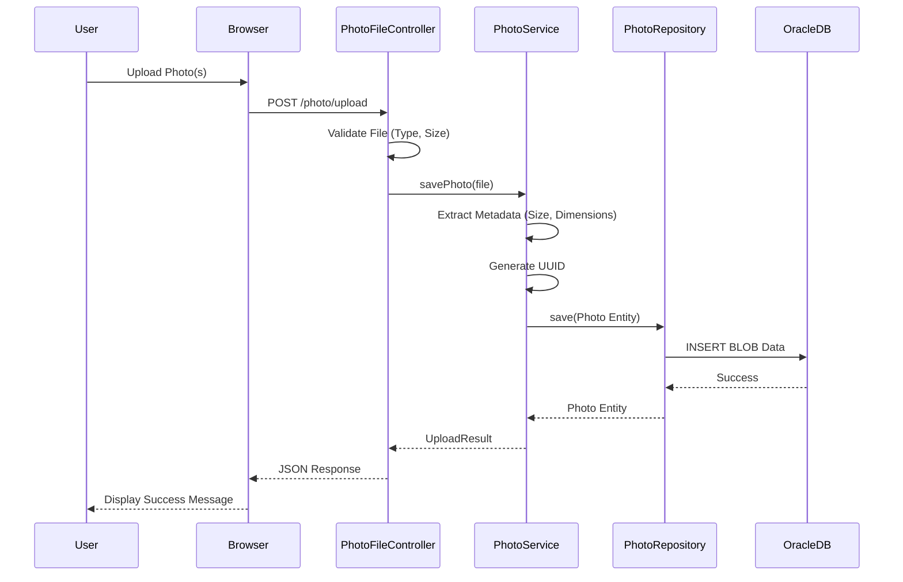
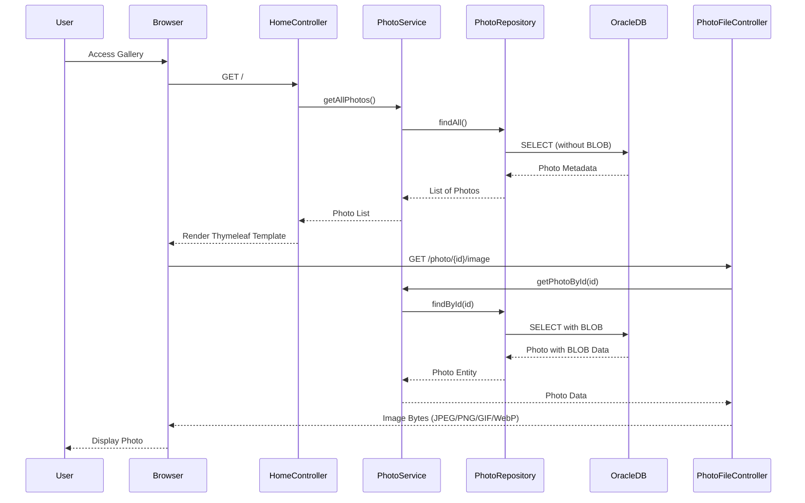
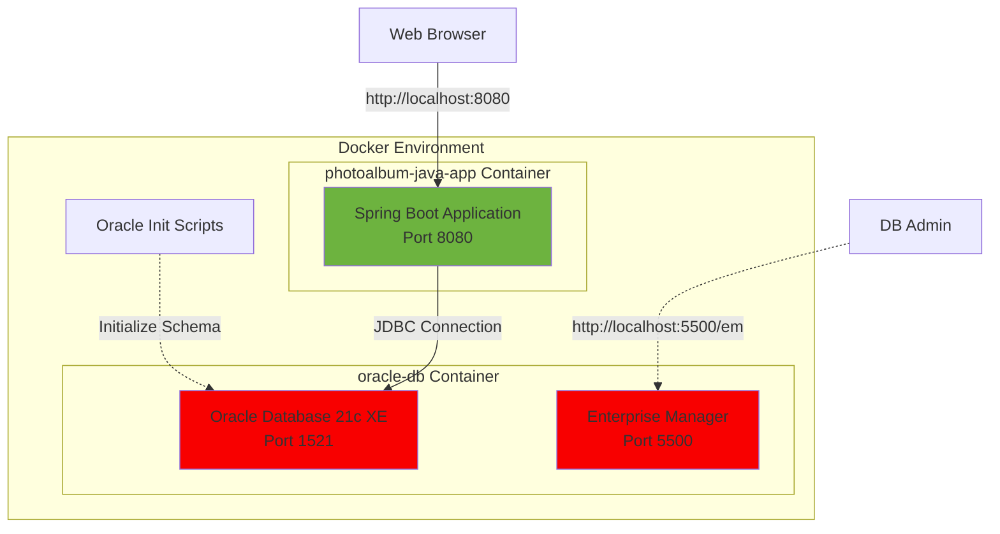

# Photo Album Application - Architecture Diagram

## Application Overview

This is a Spring Boot-based photo gallery application that allows users to upload, view, and manage photos. Photos are stored as BLOBs in Oracle Database.

## Architecture Diagram

## Technology Stack

## Data Flow - Photo Upload

## Data Flow - Photo Display

## Application Layers

### 1. Presentation Layer
- **Thymeleaf Templates**: Server-side rendering of HTML views
- **Bootstrap 5**: Responsive UI framework
- **Vanilla JavaScript**: Client-side interactions (drag-and-drop, AJAX)

### 2. Controller Layer
- **HomeController**: Gallery view and navigation
- **PhotoFileController**: Photo upload, image serving, delete operations
- **DetailController**: Photo detail view with metadata display

### 3. Service Layer
- **PhotoService**: Business logic interface
- **PhotoServiceImpl**: Implementation with photo processing logic
  - File validation (type, size)
  - Metadata extraction (dimensions, file size)
  - UUID generation for cache-busting

### 4. Data Access Layer
- **PhotoRepository**: Spring Data JPA repository interface
- **Spring Data JPA**: Data access abstraction
- **Hibernate**: ORM for database operations

### 5. Data Storage Layer
- **Oracle Database 21c Express Edition**
- **PHOTOS Table**: Stores photo metadata and BLOB data
  - Photo metadata (filename, size, dimensions, mime type)
  - Photo data as BLOB (binary large object)
  - UUID-based primary key

## Key Dependencies

| Dependency | Version | Purpose |
|------------|---------|---------|
| Spring Boot | 2.7.18 | Application framework |
| Spring Web | (via starter) | Web MVC and REST |
| Spring Data JPA | (via starter) | Data access layer |
| Thymeleaf | (via starter) | Template engine |
| Oracle JDBC Driver | ojdbc8 | Database connectivity |
| Apache Commons IO | 2.11.0 | File operations |
| Spring Validation | (via starter) | Input validation |
| Bootstrap | 5.3.0 | Frontend styling |

## Configuration Highlights

### Database Configuration
- **Connection**: `jdbc:oracle:thin:@oracle-db:1521/FREEPDB1`
- **Hibernate DDL**: Auto-create schema
- **Dialect**: Oracle

### File Upload Configuration
- **Max File Size**: 10MB
- **Max Request Size**: 50MB
- **Allowed Types**: JPEG, PNG, GIF, WebP
- **Max Files per Upload**: 10

### Application Settings
- **Server Port**: 8080
- **Java Version**: 1.8
- **Encoding**: UTF-8
- **Logging**: DEBUG level for application and Spring Web

## Deployment Architecture

## Storage Strategy

### BLOB Storage in Database
- Photos stored directly in Oracle Database as BLOB data
- No file system dependencies
- Benefits:
  - ACID compliance for photo operations
  - Simplified backup and restore
  - Perfect for containerized environments
  - No shared file system needed

### UUID System
- Each photo assigned a unique UUID identifier
- Generated by Java: `UUID.randomUUID().toString()`
- Benefits:
  - Eliminates browser caching issues
  - Globally unique across systems
  - URL-safe identifiers

## External Integrations

- **None**: This is a self-contained application with no external service dependencies

## Summary

This Photo Album application follows a traditional **3-tier architecture**:

1. **Presentation Tier**: Thymeleaf templates + Bootstrap + JavaScript
2. **Application Tier**: Spring Boot with MVC pattern (Controllers → Services → Repositories)
3. **Data Tier**: Oracle Database with BLOB storage

The architecture is well-suited for containerized deployment and follows Spring Boot best practices with clear separation of concerns across layers.
